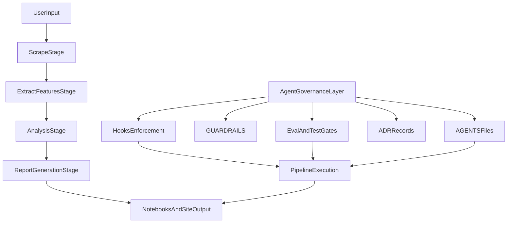

# Mediaite Forensics Setup Plan

## Assumptions From Source Docs

- Build target is the forensic pipeline in the spec (`scrape -> extract -> analyze -> report`) centered on Python modules and notebooks.
- Project profile will be `pipeline` with explicit AI-agent governance artifacts added (prompts, hooks, ADRs, guardrails), because you asked for the full agent setup.
- Use `uv` for all Python execution and project lifecycle commands.

## Phase 1: Establish Profile and Governance Baseline

- Set project profile values inferred from the spec:
  - `project_name`: `mediaite-ghostink`
  - `mode`: `new`
  - `project_type`: `pipeline`
  - `python_version`: `3.12`
  - `framework`: `none` (pipeline-first), with optional FastAPI extension later if needed
  - `ai_framework`: `pydantic-ai` (for any agentic/report helper components)
- Initialize repo metadata and governance roots:
  - [AGENTS.md](AGENTS.md)
  - [AGENTS.staging.md](AGENTS.staging.md)
  - [CLAUDE.md](CLAUDE.md)
  - [.claude/settings.json](.claude/settings.json)
  - [.claude/hooks/](.claude/hooks/)
  - [.claude/evals/](.claude/evals/)

## Phase 2: Scaffold Codebase to Match the Spec Architecture

- Create Python package and module structure aligned to the Notion spec:
  - [src/forensics/config/](src/forensics/config/)
  - [src/forensics/models/](src/forensics/models/)
  - [src/forensics/scraper/](src/forensics/scraper/)
  - [src/forensics/features/](src/forensics/features/)
  - [src/forensics/analysis/](src/forensics/analysis/)
  - [src/forensics/storage/](src/forensics/storage/)
  - [src/forensics/utils/](src/forensics/utils/)
- Add CLI entrypoints reflecting the documented workflow (`scrape`, `extract`, `analyze`, `report`, `all`).
- Scaffold supporting work areas:
  - [notebooks/](notebooks/)
  - [data/](data/)
  - [tests/unit/](tests/unit/)
  - [tests/integration/](tests/integration/)

## Phase 3: Generate Core Config and Dependency Files

- Build [pyproject.toml](pyproject.toml) from template + current versions reference (not stale defaults), including:
  - runtime deps for scraping/NLP/analysis/storage/reporting
  - dev/test deps (`pytest`, `pytest-asyncio`, `pytest-cov`, `hypothesis`, `ruff`, `pre-commit`)
  - pytest, ruff, coverage config sections
- Create environment and hygiene files:
  - [.env.example](.env.example) with only project-relevant variables and `op://...` placeholders for secrets
  - [.gitignore](.gitignore) adapted for Python + notebooks + data artifacts
  - [.pre-commit-config.yaml](.pre-commit-config.yaml)
  - [.ruff.toml](.ruff.toml)

## Phase 4: Build Agent/Governance Documentation Set

- Generate docs adapted to this project (not verbatim template copies):
  - [docs/ARCHITECTURE.md](docs/ARCHITECTURE.md)
  - [docs/TESTING.md](docs/TESTING.md)
  - [docs/GUARDRAILS.md](docs/GUARDRAILS.md)
  - [docs/DEPLOYMENTS.md](docs/DEPLOYMENTS.md)
  - [docs/RUNBOOK.md](docs/RUNBOOK.md)
- In [AGENTS.md](AGENTS.md):
  - merge base + pipeline overlay standards
  - include explicit scope, model pinning, conflict hierarchy, and tool resolution reference
  - include `## Notion References` block for Tasks DB + Project + Client linkage
- In [AGENTS.staging.md](AGENTS.staging.md):
  - enforce staging constraints (read-heavy, no source edits, strict evaluation gate)

## Phase 5: Add Prompt Artifacts and Task/Handoff Protocol

- Create versioned prompt artifact structure:
  - [prompts/](prompts/)
  - [prompts/README.md](prompts/README.md)
  - [prompts/core-agent/current.md](prompts/core-agent/current.md)
  - [prompts/core-agent/v0.1.0.md](prompts/core-agent/v0.1.0.md)
  - [prompts/core-agent/CHANGELOG.md](prompts/core-agent/CHANGELOG.md)
  - [prompts/core-agent/versions.json](prompts/core-agent/versions.json)
- Enforce prompt versioning contract:
  - every behavior/model/tooling change creates a new immutable `vX.Y.Z.md` snapshot
  - `current.md` is always a copy of the latest immutable version
  - `CHANGELOG.md` entries include version, model, why, eval impact, and date
  - `versions.json` is the machine-readable index for hooks/CI checks
- Define `prompts/README.md` as prompt-library source of truth:
  - folder conventions and naming
  - semver bump rules for prompts (MAJOR/MINOR/PATCH)
  - required prompt-file header fields
  - release/promote/rollback workflow (dev -> staging -> prod)
  - validation checklist and ownership
- Add operational task orchestration artifacts:
  - [TASK.md](TASK.md)
  - [HANDOFF.md](HANDOFF.md)
- Seed ADR framework and initial records:
  - [docs/adr/ADR-001-hybrid-forensics-methodology.md](docs/adr/ADR-001-hybrid-forensics-methodology.md)
  - [docs/adr/ADR-002-storage-layer-sqlite-parquet-duckdb.md](docs/adr/ADR-002-storage-layer-sqlite-parquet-duckdb.md)
  - [docs/adr/ADR-003-agent-governance-and-hooks.md](docs/adr/ADR-003-agent-governance-and-hooks.md)

## Phase 6: Install Deterministic Hook Enforcement

- Implement Python/Both hooks from the Hooks Reference in [.claude/hooks/](.claude/hooks/):
  - dangerous command blocker
  - sensitive file guard
  - Alembic versions guard (kept if migrations are added later)
  - PII scan
  - secrets scanner
  - tests-required gate
  - post-edit python auto-format
  - post-edit tests feedback loop
  - sync-import warning (if API routes are later added)
  - command audit log
- Register hooks in [.claude/settings.json](.claude/settings.json) and add local artifacts to [.gitignore](.gitignore).

## Phase 7: CI, Quality Gates, and Eval-Driven Checks

- Create CI workflow files:
  - [.github/workflows/ci.yml](.github/workflows/ci.yml) for lint/test/coverage thresholds
  - optional label sync + release workflows based on project maturity
- Add AGENTS governance lint gate:
  - [scripts/lint_agents_md.py](scripts/lint_agents_md.py)
  - CI trigger on `AGENTS*.md` changes
- Seed eval-driven tests:
  - [tests/evals/](tests/evals/)
  - [.claude/evals/core.md](.claude/evals/core.md)

## Phase 8: Verification, Registration, and Handoff

- Run setup verification sequence:
  - `uv sync`
  - `uv run ruff check .`
  - `uv run ruff format --check .`
  - `uv run pytest tests/ -v`
- Register project artifacts in Notion (Project + minimum skill/task records) and ensure [AGENTS.md](AGENTS.md) references are resolved.
- Finalize with a concise onboarding README linking architecture, runbook, guardrails, testing strategy, and ADR index.

## Architecture Snapshot

