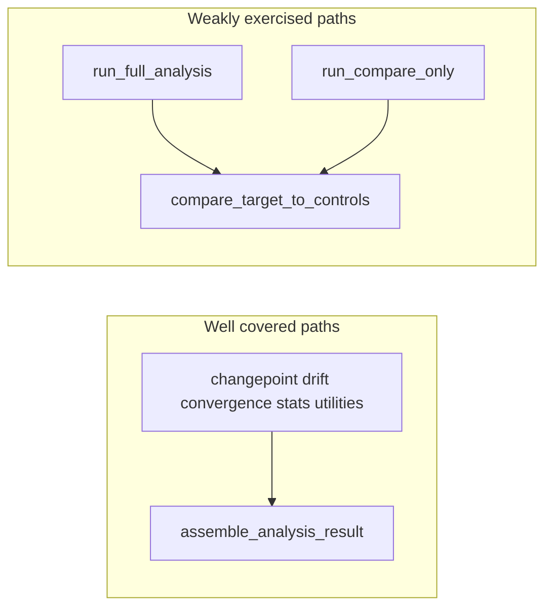

# Coverage run and gap-fill plan

## Constraint: coverage was not executed in this session

**Plan mode** disallows running pytest with coverage because it mutates the workspace (`.coverage`, `coverage.json`, `.pytest_cache`, optional `htmlcov/`). The steps below assume **you approve Agent mode** (or you run the commands locally) so real numbers drive prioritization.

## Step 1 — Run tests with coverage (authoritative)

From repo root, dependencies already include `pytest-cov` under the `dev` extra ([`pyproject.toml`](pyproject.toml)):

- **Default local/CI-style run** (respects `[tool.pytest.ini_options]` including `--cov=forensics`, `--cov-report=term-missing`, `-m 'not slow'`, and **`fail_under = 72`** in [`[tool.coverage.report]`](pyproject.toml)):

```bash
uv sync --frozen --extra dev
uv run python -m spacy download en_core_web_md
uv run pytest
```

- **Match the GitHub workflow invocation** (currently passes extra flags):

```bash
uv run pytest tests/ --junitxml=test-results.xml --cov-report=json:coverage.json --cov-report=term -v
```

Note: [`.github/workflows/ci-tests.yml`](.github/workflows/ci-tests.yml) adds **`--cov=src`** while `addopts` already sets **`--cov=forensics`**. That means CI runs **two** coverage contexts unless one overrides the other; the JSON artifact may not match what you see from a plain `uv run pytest`. **First remediation after a coverage run:** pick one measurement root (`forensics` aligns with [`[tool.coverage.run] source = ["forensics"]`](pyproject.toml)) and update the workflow so `coverage.json` is unambiguous.

- **Optional HTML drill-down** (after fixing CI if needed):

```bash
uv run pytest --cov-report=html
```

Use `coverage.json` / HTML “missing” lines to reorder work if static guesses below are wrong.

## Step 2 — Largest known functional gap (static)

**`compare_target_to_controls`** in [`src/forensics/analysis/comparison.py`](src/forensics/analysis/comparison.py) is only referenced from [`src/forensics/analysis/orchestrator.py`](src/forensics/analysis/orchestrator.py) (`run_full_analysis` and `run_compare_only`). **No test file imports `compare_target_to_controls` directly** (repo-wide grep).

**`run_full_analysis(...)`** is never invoked in tests except as a **fake** in [`tests/test_survey.py`](tests/test_survey.py).

The integration test that comes closest to analyze/compare **explicitly stubs** comparison work:

```136:137:tests/integration/test_cli.py
    # --compare short-circuits analyze after verify; stub the comparison to skip real work.
    monkeypatch.setattr(orch_mod, "run_compare_only", lambda *a, **kw: None)
```

So orchestration + comparison are structurally under-tested even if aggregate coverage passes `fail_under`.



**Recommended tests (incremental, no redesign):**

1. **Unit tests on `compare_target_to_controls`** (new file under `tests/`, e.g. `tests/unit/test_comparison_target_controls.py`): build a minimal `tmp_path` layout with:
   - tiny feature parquet(s) for one target + one or two controls under the paths expected by [`AnalysisArtifactPaths`](src/forensics/analysis/artifact_paths.py),
   - optional pre-written `*_changepoints.json` to avoid recomputing PELT if that keeps the test fast and deterministic,
   - a small SQLite DB via existing `init_db` / `Repository` patterns from [`tests/conftest.py`](tests/conftest.py) and peers.
   Assert the returned report structure (keys, non-empty `targets` payload, or explicit “skip” behavior) so refactors do not silently break compare.

2. **`run_compare_only` smoke** with the same fixture: verifies JSON write to `comparison_report.json` and logging branches in [`run_compare_only`](src/forensics/analysis/orchestrator.py) (e.g. `author_slug` not in configured targets) without pulling in the full `run_full_analysis` loop unless you want a second heavier test marked `@pytest.mark.slow`.

3. Only if coverage still lags after (1)–(2): a **narrow** `run_full_analysis` test with **one** author slug and heavy monkeypatching of the slowest steps (already a pattern in [`tests/test_preregistration.py`](tests/test_preregistration.py) for analyze stages)—keep scope minimal per your “incremental fixes” rule.

## Step 3 — Secondary targets (use coverage missing lines to confirm)

These are **suspected** thin spots from import/test mapping; treat coverage output as source of truth:

| Area | Why |
|------|-----|
| [`src/forensics/tui/screens/`](src/forensics/tui/screens/) (e.g. `launch.py`, `discovery.py`, `preflight.py`) | [`tests/test_tui.py`](tests/test_tui.py) focuses on `dependencies` + `config`; other screens may be mostly manual. |
| CLI modules beyond help smoke | Help is covered in [`tests/integration/test_cli.py`](tests/integration/test_cli.py); deeper behavior may live in [`src/forensics/cli/`](src/forensics/cli/) subcommands with fewer assertions. |
| Omitted baseline live paths | [`[tool.coverage.run] omit`](pyproject.toml) excludes `baseline/orchestrator.py` and `baseline/agent.py` by design; do not chase those in `fail_under` unless you remove `omit` intentionally. |

## Step 4 — Definition of done

- `uv run pytest` passes with **`fail_under = 72`** unchanged (or raised only if you intentionally broaden scope).
- CI workflow uses a **single clear** `--cov=...` target consistent with `[tool.coverage.run]`.
- At least one test executes **`compare_target_to_controls`** without monkeypatching it away; optionally **`run_compare_only`** on a toy fixture.
