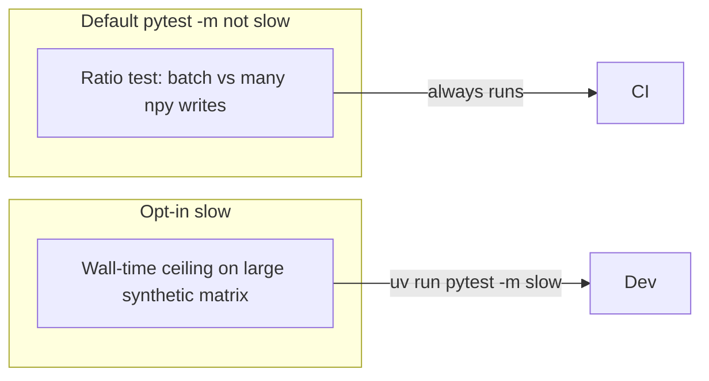

# Close plan gap: embedding I/O benchmark

## Verification recap

Cross-checking [`.cursor/plans/report_changes_implementation_7606298f.plan.md`](.cursor/plans/report_changes_implementation_7606298f.plan.md) against the repo shows the listed todos are implemented: Typer-only CLI under [`src/forensics/cli/`](src/forensics/cli/), provenance via [`open_repository_connection`](src/forensics/utils/provenance.py), [`KeyedModelCache`](src/forensics/utils/model_cache.py), batched embeddings in [`write_author_embedding_batch`](src/forensics/storage/parquet.py) / drift loaders, narrowed `_FEATURE_EXTRACTION_ERRORS` in [`pipeline.py`](src/forensics/features/pipeline.py), orchestrator helpers, module-level [`_fetch_one_article_html`](src/forensics/scraper/fetcher.py), DuckDB + Parquet coverage in [`tests/test_parquet_embeddings_duckdb.py`](tests/test_parquet_embeddings_duckdb.py), slim coverage omits in [`pyproject.toml`](pyproject.toml). [`src/forensics/utils/charts.py`](src/forensics/utils/charts.py) is intentionally retained (used by [`tests/test_report.py`](tests/test_report.py)).

**Remaining gap:** Phase 5 bullet “Add regression tests and a small benchmark for embedding load/write performance.” Regression tests exist; **no benchmark** is present (no `pytest-benchmark`, no `perf_counter` performance test).

## Recommended approach

Avoid pulling `pytest-benchmark` into default CI (extra dependency and variable runtime). Split into two layers:

### 1. Default CI: regression-style “benchmark” (ratio, not seconds)

Add a test (either in [`tests/test_parquet_embeddings_duckdb.py`](tests/test_parquet_embeddings_duckdb.py) or a small new file e.g. `tests/test_embedding_batch_performance.py`) that:

- Uses **only** `numpy` + existing [`write_author_embedding_batch`](src/forensics/storage/parquet.py) (and `np.save` for the baseline), under `tmp_path`.
- Fixes **N** (e.g. 100–300) and embedding **dim** (e.g. 64), `float32`, no sentence-transformers.
- Measures `time.perf_counter()` for:
  - **A:** one `write_author_embedding_batch` for all IDs and a stacked `(N, dim)` array.
  - **B:** a loop of `N` `np.save` calls for per-article vectors (legacy-style pattern the batch path replaced).
- Asserts **A &lt; B** (or `A &lt;= B * 0.95`) with a small number of **repetitions** (e.g. 3) and take the median or min to reduce noise—still deterministic and catches accidental regression toward per-file I/O.

This satisfies “small benchmark” semantics (comparative performance guard) without flaky absolute SLAs.

### 2. Optional: `@pytest.mark.slow` absolute ceiling

[`pyproject.toml`](pyproject.toml) already excludes `slow` from default runs (`addopts` … `-m 'not slow'`). Add one `@pytest.mark.slow` test that writes a **larger** synthetic batch (e.g. 5k–20k rows × 384) and loads with `numpy.load` / the same keys [`parquet.py`](src/forensics/storage/parquet.py) uses—assert total wall time under a **generous** bound (tuned once locally so CI agents rarely fail). Document the invocation in a one-line comment above the test: `uv run pytest tests/... -m slow`.

### 3. Documentation touch (minimal)

In [`docs/TESTING.md`](docs/TESTING.md) “Performance Benchmarks” section, add one bullet pointing to the new test file and the `-m slow` command for the optional ceiling test—keeps the plan’s Phase 6 traceability without expanding scope.

## Out of scope

- Changing embedding storage format or drift loading behavior (incremental only).
- Adding `pytest-benchmark` unless you explicitly want histogram-style reports; the ratio test covers the plan gap with less tooling.

## Success criteria

- Default `uv run pytest tests/` (respecting existing `-m 'not slow'`) runs the new ratio test and passes.
- Optional slow test passes when run explicitly.
- No new production dependencies; dev deps unchanged unless you choose pytest-benchmark later.
