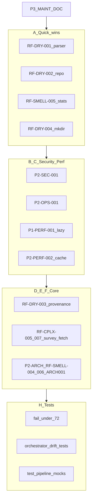

# Implement Notion code review + refactoring reports

Sources: [Code Review Report](https://www.notion.so/34c7d7f56298818b954dc6139a3d365e), [Refactoring Analysis Report](https://www.notion.so/34c7d7f5629881588c1ccdc86fede129).

## Repo reality checks (adjust Notion text, do not skip work)

- **`_iter_manifests_from_users_json`** ([`src/forensics/scraper/crawler.py`](src/forensics/scraper/crawler.py)) is **imported and tested** in [`tests/test_scraper.py`](tests/test_scraper.py). Implement RF-DEAD-003 as: **keep**, strengthen module/docstring as **supported test/tooling surface** (align with [`prompts/phase13-review-remediation/v0.1.0.md`](prompts/phase13-review-remediation/v0.1.0.md)), not deletion.
- **`read_features`** ([`src/forensics/storage/parquet.py`](src/forensics/storage/parquet.py)) still has callers in tests and [`notebooks/04_feature_analysis.ipynb`](notebooks/04_feature_analysis.ipynb). Implement RF-DEAD-004 as: **`@warnings.deprecated` (3.13) or `warnings.warn(DeprecationWarning, stacklevel=2)`** plus docstring pointing to `scan_features`, migrate **in-repo** callers where trivial; leave notebook import with a one-line comment or follow-up cell note—do not remove the API until callers are gone.
- **C901 configuration**: Notion cites `pyproject.toml:L92-97` per-file ignores; current [`pyproject.toml`](pyproject.toml) may have drifted. Start implementation with `uv run ruff check --select C901 src/forensics` to list **live** violations; goal remains: **remove complexity or justify minimal suppressions** for [`probability_pipeline.py`](src/forensics/baseline/probability_pipeline.py) (path per report), [`crawler.py`](src/forensics/scraper/crawler.py), [`dedup.py`](src/forensics/scraper/dedup.py), [`parser.py`](src/forensics/scraper/parser.py), [`utils/hashing.py`](src/forensics/utils/hashing.py).

## Workstreams (ordered for merge safety)

### A — Quick wins (Refactoring §7 + Code Review quick wins)

| ID | Action | Primary files |
|----|--------|---------------|
| RF-DRY-001 | Add `_sanitize_and_extract(soup_or_tag) -> str` for shared steps 2–5; both `extract_article_text` and `extract_article_text_from_rest` call it after container selection. | [`parser.py`](src/forensics/scraper/parser.py) |
| RF-DRY-002 | `_validate_batch_size(batch_size: int) -> None` used by `iter_articles_by_author`, `iter_all_articles`, `iter_dedup_source_rows`. | [`repository.py`](src/forensics/storage/repository.py) |
| RF-SMELL-005 | Shared base fields / small factory for three `HypothesisTest` constructions in `run_hypothesis_tests`. | [`statistics.py`](src/forensics/analysis/statistics.py) |
| RF-DRY-004 | Eliminate remaining raw `parent.mkdir(...)` per report: route through existing atomic helpers or add **`ensure_parent(path: Path) -> None`** in [`json_io.py`](src/forensics/storage/json_io.py) (or smallest shared storage util) and replace the **remaining** call sites called out (`export.py`, `duckdb_queries.py`, any others found by ripgrep). | `storage/*.py`, [`fetcher.py`](src/forensics/scraper/fetcher.py) if still raw |

### B — Security and ops (Code Review P2)

| ID | Action | Primary files |
|----|--------|---------------|
| P2-SEC-001 | Replace bare `except Exception` on hot paths with a **narrow tuple** (e.g. `httpx.HTTPError`, `OSError`, `ValueError`, `KeyError`, `TypeError` as Notion suggests); **re-raise** unexpected exceptions after logging traceback so programming errors surface. | [`crawler.py`](src/forensics/scraper/crawler.py) (~L423), [`cli/__init__.py`](src/forensics/cli/__init__.py) (~L159 and any similar sites) |
| P2-OPS-001 | Add **`--log-format {text,json}`** (or equivalent) on the Typer callback in [`cli/__init__.py`](src/forensics/cli/__init__.py); JSON path uses **`python-json-logger`** (add to [`pyproject.toml`](pyproject.toml) deps). Default remains human text. Wire `logging.basicConfig` / handler formatter accordingly. | `pyproject.toml`, `cli/__init__.py` |

### C — Performance (Code Review P1 + P2)

| ID | Action | Primary files |
|----|--------|---------------|
| P1-PERF-001 | In [`orchestrator.py`](src/forensics/analysis/orchestrator.py) `_run_per_author_analysis`, build **`lf_author = lf_all.filter(author_id == ...)`** first; only **`collect()`** the full frame for the documented empty fallback; add **`.select(...)`** if downstream code only needs a known column subset (confirm against `analyze_author_feature_changepoints` / hypothesis path before shrinking columns). | `orchestrator.py`, possibly [`analysis/utils.py`](src/forensics/analysis/utils.py) if helpers should own the lazy chain |
| P2-PERF-002 | Replace manual `OrderedDict` LRU in [`content.py`](src/forensics/features/content.py) with **`functools.lru_cache`** on a pure function keyed by a hashable key (e.g. tuple of inputs), **or** guard with `threading.Lock` if keeping mutable cache—prefer `lru_cache` if keys are cheap and function is pure. | `content.py` |

### D — DRY / provenance (Refactoring RF-DRY-003)

- Add **`compute_config_hash(model: BaseModel, *, length: int = 16) -> str`** (or match existing `_config_digest` naming) in [`utils/provenance.py`](src/forensics/utils/provenance.py).
- Replace ad-hoc SHA-256 snippets in [`analysis/orchestrator.py`](src/forensics/analysis/orchestrator.py) (~L267), [`survey/orchestrator.py`](src/forensics/survey/orchestrator.py) (~L76), and any duplicate in provenance—**unify truncation** to the chosen default (16 unless a consumer requires 12; then use parameter).

### E — Complexity decomposition (Code Review P1-MAINT-001 + Refactoring RF-CPLX-005/006/007)

1. **`crawler.py` — `discover_authors`**: extract inner loops / JSON parsing / pagination into private helpers (e.g. `_fetch_users_page`, `_parse_user_payload`) until Ruff C901 passes without new ignores.
2. **`dedup.py` — `deduplicate_articles`**: delegate banding/union-find steps to existing helpers where possible; shrink cyclomatic complexity.
3. **`parser.py` — `extract_metadata`**: sequential extractions → small `_og_meta`, `_ld_json_meta` helpers (pairs with RF-DRY-001).
4. **`probability_pipeline.py`**: same extract-method discipline (only if C901 still flags after measurement).
5. **`hashing.py` — `simhash`**: if still algorithmically dense, **keep** a single file-level `# noqa: C901` with comment that bit-inner-loop is intrinsic (per report)—only after attempting trivial extraction of n-gram / mixing steps.
6. **RF-CPLX-006 — `run_survey`**: split into **`_run_authors_parallel`**, **`_run_authors_sequential`**, **`_finalize_survey`** (and any small shared setup) in [`survey/orchestrator.py`](src/forensics/survey/orchestrator.py).
7. **RF-CPLX-007 — `fetcher.py` `_handle_success`**: extract **`_commit_parsed_article(...)`** for the write leg under lock as described; preserve double-lock semantics and documented concurrency contract.

### F — Bounded structural refactors (assessment docs; incremental, not new providers)

| ID | Action | Notes |
|----|--------|-------|
| P2-ARCH-001 | Introduce **`RepositoryReader`** as a **mixin** (or separate class composed into `Repository`) holding read/query/stream iterators; **`Repository`** keeps connection lifecycle + writes. | Staged PR-friendly: move read-only methods first, run full tests. |
| RF-SMELL-004 | Split **`ArticleHtmlFetchContext`** into **`FetchConfig`** (frozen/immutable settings) + **`FetchSession`** (mutable counters, locks, semaphores) in [`fetcher.py`](src/forensics/scraper/fetcher.py). | Update constructors and call sites in the same module only unless imports exist elsewhere (grep). |
| RF-SMELL-006 | Introduce **`NamedTuple`** / small typed aliases for repeated tuple shapes (`MonthlyVelocity`, baseline point, centroid tuples) across [`drift.py`](src/forensics/analysis/drift.py), [`convergence.py`](src/forensics/analysis/convergence.py), [`comparison.py`](src/forensics/analysis/comparison.py). | Keep `DriftPipelineResult`; extend types inward from public boundaries. |
| RF-ARCH-001 | Add **optional in-memory `changepoints_cache`** parameter to **`compare_target_to_controls`** ([`comparison.py`](src/forensics/analysis/comparison.py)); [`run_full_analysis`](src/forensics/analysis/orchestrator.py) passes dict when available; disk path unchanged for standalone compare. | |

### G — API clarity and onboarding (Code Review P3)

| ID | Action |
|----|--------|
| P3-MAINT-001 | Add **`__all__`** to modules called out (or all package-level public modules): `analysis/orchestrator.py`, `features/pipeline.py`, `storage/repository.py`, and any others discovered when auditing `from forensics.X import *` risk. |
| P3-DOC-001 | Add **`config.toml.example`** with placeholders + short README/setup pointer; either **gitignore root `config.toml`** *or* keep tracked `config.toml` with a **prominent top-of-file block** explaining replace-before-run—pick one consistent story with existing setup wizard ([`survey` / setup flows](src/forensics/cli/survey.py)). |

### H — Testing and coverage (Code Review P1-TEST-001, P3-TEST-002)

- Raise **[`tool.coverage.report.fail_under`](pyproject.toml)** from **66 → 72** after tests land (Notion target 72%).
- **Integration-style tests** using fixture Parquet + minimal embeddings under `tmp_path`:
  - **`analysis/orchestrator.py`**: key branches of `_run_per_author_analysis` / `run_full_analysis` where feasible without Ollama.
  - **`analysis/drift.py`** / convergence path: exercise `compute_author_drift_pipeline` and downstream scoring with small synthetic arrays.
- **P3-TEST-002**: Extend [`tests/test_pipeline.py`](tests/test_pipeline.py) with **mocked stage functions** calling `run_all_pipeline`, asserting **stage order** and **exit code propagation** on injected failures.

### I — Verification gate (run locally before merge)

- `uv run ruff check src tests`
- `uv run pytest` (full suite)
- Confirm coverage **≥ 72%** after `fail_under` bump
- Optional: `uv run ty check` if project uses ty

## Dependency sketch

## Risk and conflict note (your incremental-change rule)

The largest touch items are **P2-ARCH-001** (Repository split) and **RF-SMELL-004** (fetch context split). Both are **explicit** in the Notion documents as extract-mixin / extract-class refactors **without** swapping HTTP, DB, or analysis providers. If you want zero class-shape change, say so before execution; the written request here is to **not defer** those items.
