# Parallel Evidence Refresh Plan

## Approach

Use an isolated fan-out / validate / promote flow instead of calling `forensics analyze --author` against the canonical `data/analysis/` directory for every author.

```mermaid
flowchart LR
  canonicalInputs["Canonical inputs: config, DB, features, embeddings"] --> authorJobs["Parallel author jobs"]
  authorJobs --> isolatedDirs["data/analysis/parallel/<run_id>/<slug>/"]
  isolatedDirs --> validation["Validate config hash and required artifacts"]
  validation --> promotion["Promote per-author artifacts to data/analysis/"]
  promotion --> sharedRebuild["Regenerate comparison, metadata, custody once"]
  sharedRebuild --> reportPages["Render per-author evidence pages"]
```

Task ID: TASK-1
Title: Add isolated author analysis runner
Exec mode: sequential
Model: claude-sonnet-4-6
Model rationale: Default multi-step code model; touches analysis orchestration and artifact semantics.
Est. tokens: ~50K
Risk: MEDIUM

- Add a focused helper, likely in [`src/forensics/analysis/orchestrator.py`](src/forensics/analysis/orchestrator.py), that runs one author with `AnalysisArtifactPaths.with_analysis_dir(...)` so `run_metadata.json`, `comparison_report.json`, sensitivity outputs, and per-author JSON files land in a private directory.
- Do not change detector logic or stage contracts.

Task ID: TASK-2
Title: Add parallel refresh entry point
Exec mode: sequential[after: TASK-1]
Model: claude-sonnet-4-6
Model rationale: CLI/API integration needs careful option defaults and safe worker limits.
Est. tokens: ~50K
Risk: MEDIUM

- Add a CLI or internal utility path, for example `forensics analyze --parallel-authors --max-workers 3`, that dispatches stale configured authors in parallel.
- Default `max_workers` conservatively to `min(3, os.cpu_count() - 1)` unless `settings.analysis.max_workers` is configured.
- Each worker writes only to its own `data/analysis/parallel/<run_id>/<slug>/` directory.

Task ID: TASK-3
Title: Validate and promote artifacts
Exec mode: sequential[after: TASK-2]
Model: claude-sonnet-4-6
Model rationale: Correctness-sensitive file promotion and hash validation.
Est. tokens: ~50K
Risk: HIGH

- Before promotion, validate each isolated `{slug}_result.json` has `config_hash == compute_analysis_config_hash(settings)` and includes the required companion files.
- Promote per-author artifacts into `data/analysis/` only after validation succeeds for that author.
- Regenerate shared artifacts exactly once after promotion: `comparison_report.json`, `run_metadata.json`, and corpus custody.

Task ID: TASK-4
Title: Tests and validation
Exec mode: sequential[after: TASK-3]
Model: claude-sonnet-4-6
Model rationale: Needs targeted tests around concurrency-safe artifact writes plus existing report tests.
Est. tokens: ~50K
Risk: MEDIUM

- Add tests proving parallel/isolated runs do not write shared canonical files until promotion.
- Keep existing report behavior unchanged unless `--per-author` or the new parallel refresh option is explicitly used.
- Validate with `uv run pytest tests/test_report.py ...`, targeted analysis/orchestrator tests, `uv run ruff check .`, and `uv run ruff format --check .`.

## Execution Notes

- The previous long sequential job has been stopped.
- This does not require redesigning providers, stages, or data models; it changes only how per-author analysis artifacts are staged and promoted.
- I recommend starting with `--max-workers 3` to avoid memory pressure from multiple UMAP/embedding jobs.