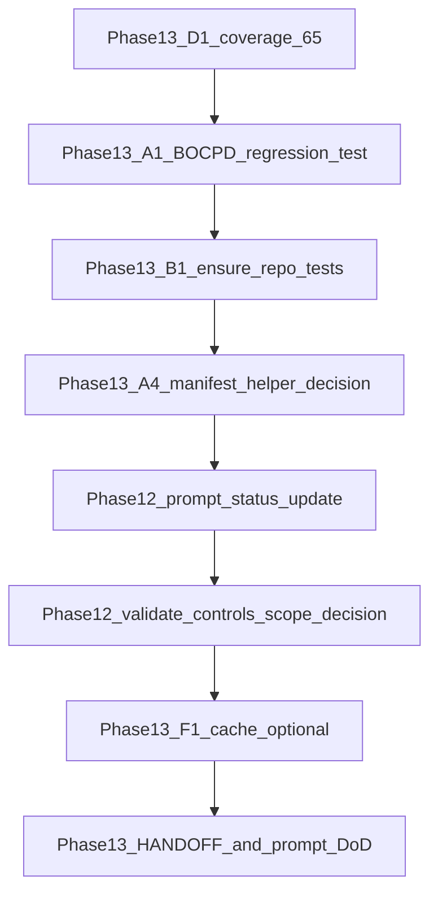

# Phase 12–13 completion and gap closure

## What the audit found

### Phase 12 ([`prompts/phase12-survey-tui-hardening/current.md`](prompts/phase12-survey-tui-hardening/current.md))

**Implemented in code (high confidence):** survey package ([`src/forensics/survey/`](src/forensics/survey/)), TUI ([`src/forensics/tui/`](src/forensics/tui/) with graceful missing-extra handling in [`src/forensics/tui/__init__.py`](src/forensics/tui/__init__.py)), calibration ([`src/forensics/calibration/`](src/forensics/calibration/)), preflight ([`src/forensics/preflight.py`](src/forensics/preflight.py)), preregistration ([`src/forensics/preregistration.py`](src/forensics/preregistration.py)), permutation ([`src/forensics/analysis/permutation.py`](src/forensics/analysis/permutation.py)), narrative ([`src/forensics/reporting/narrative.py`](src/forensics/reporting/narrative.py)), CLI wiring in [`src/forensics/cli/__init__.py`](src/forensics/cli/__init__.py), `simhash_threshold` on [`ScrapingConfig`](src/forensics/config/settings.py) wired in [`src/forensics/cli/scrape.py`](src/forensics/cli/scrape.py), pipeline preflight in [`src/forensics/pipeline.py`](src/forensics/pipeline.py), notebooks [`notebooks/10_survey_dashboard.ipynb`](notebooks/10_survey_dashboard.ipynb) and [`notebooks/11_calibration.ipynb`](notebooks/11_calibration.ipynb), and tests [`tests/test_survey.py`](tests/test_survey.py), [`tests/test_calibration.py`](tests/test_calibration.py), [`tests/test_preflight.py`](tests/test_preflight.py), [`tests/test_preregistration.py`](tests/test_preregistration.py), [`tests/test_permutation.py`](tests/test_permutation.py), [`tests/test_tui.py`](tests/test_tui.py).

**Gaps vs the prompt artifact (not necessarily vs product intent):**

1. **Prompt metadata still says “pending”** — [`prompts/phase12-survey-tui-hardening/current.md`](prompts/phase12-survey-tui-hardening/current.md) line 5 and [`prompts/phase12-survey-tui-hardening/versions.json`](prompts/phase12-survey-tui-hardening/versions.json) list `0.1.0` / `0.2.0` as pending. If the team agrees the scope is shipped, update status/changelog to avoid false “incomplete” signals.
2. **`validate_against_controls` depth** — [`src/forensics/survey/scoring.py`](src/forensics/survey/scoring.py) implements a **lightweight** control summary (`ControlValidation`: counts/means). The Phase 12 prose described per-feature Welch/Mann–Whitney comparisons. Decide explicitly: **defer** (document as future work in prompt or ADR) or **expand** (larger scope: load feature frames for flagged vs controls, run tests, new tests).

### Phase 13 ([`prompts/phase13-review-remediation/current.md`](prompts/phase13-review-remediation/current.md))

**Already done in tree (examples):** BOCPD inner loop is algorithmically optimized in [`detect_bocpd`](src/forensics/analysis/changepoint.py) (vectorized over segment lengths via prefix sums, not the exact slice from the prompt text but same intent); `read_features` uses `scan_parquet().collect()` in [`src/forensics/storage/parquet.py`](src/forensics/storage/parquet.py); DRY items (`ensure_repo`, `load_feature_frame_for_author`, `_changepoints_from_breaks`, `load_drift_summary`, `_persist_and_log`, `AnalyzeContext`, `_FAMILIES` loop in features validator) are present per earlier grep; C901 per-file ignores are **6 files** in [`pyproject.toml`](pyproject.toml) (meets “≤6” target).

**Concrete gaps:**

1. **D1 — Coverage gate not raised** — [`pyproject.toml`](pyproject.toml) still has `fail_under = 50` under `[tool.coverage.report]`; Phase 13 DoD calls for **65**.
2. **A1 validation — Missing regression test named in the prompt** — There is [`test_bocpd_gradual_shift`](tests/test_analysis.py) but **no** `test_bocpd_vectorized_matches_reference` anywhere under `tests/` (HANDOFF mentions it; repo and prompt are out of sync). Restore or add a test that compares current `detect_bocpd` to a small **reference implementation** on fixed seeds/signals and optionally a **`@pytest.mark.slow`** timing smoke for long signals (so default CI stays fast).
3. **B1 — `ensure_repo` unit tests** — No `tests/` references to `ensure_repo`. Add a tiny test module (e.g. `tests/unit/test_ensure_repo.py`) covering both branches: injected repo vs opening temp DB.
4. **A4 — `_iter_manifests_from_users_json`** — Still in [`src/forensics/scraper/crawler.py`](src/forensics/scraper/crawler.py) and used by [`tests/test_scraper.py`](tests/test_scraper.py). The Phase 13 prompt called it “dead”; reality is **tested API**. Either **keep** and amend Phase 13 doc as “deferred / intentional”, or **inline/move** the helper into tests only and delete from production if nothing else imports it (verify with ripgrep before removal).
5. **F1 — Self-similarity cache** — [`src/forensics/features/content.py`](src/forensics/features/content.py) still uses `@lru_cache` on `tuple(peers)`. Phase F asked for hash- or id-based keys to reduce memory pressure from large peer tuples. Treat as **optional follow-up** unless profiling shows pain; if done, add tests for cache correctness and eviction semantics.
6. **Prompt DoD checkboxes** — [`prompts/phase13-review-remediation/current.md`](prompts/phase13-review-remediation/current.md) “Definition of Done” section remains unchecked; after the above, tick or replace with a dated completion note. **Re-run python-project-review** (skill/process) should be recorded in HANDOFF when executed.

## Suggested execution order

1. Bump `fail_under` only after `uv run pytest tests/ -v --cov=forensics` shows **stable margin above 65%** (if below, add minimal tests in thin modules before raising).
2. Add BOCPD reference parity test (and optional slow timing test).
3. Add `ensure_repo` tests.
4. Resolve manifest helper: document vs refactor.
5. Align Phase 12 prompt `versions.json` / `current.md` status; resolve `validate_against_controls` scope in one sentence in docs or implement.
6. Optionally implement F1 cache key change with tests.
7. Update HANDOFF + Phase 13 prompt DoD; note python-project-review re-run.

## Out of scope unless you explicitly want it

- Rewriting survey methodology (`validate_against_controls` full statistical battery) without a product decision.
- Large TUI feature additions beyond what is already shipped.

## Re-review after pull (read-only audit)

Re-scanned the workspace after reported `git pull`. **No material change** to the gap list above:

- [`pyproject.toml`](pyproject.toml): `fail_under` still **50**; C901 per-file ignores still **6** paths.
- [`tests/test_analysis.py`](tests/test_analysis.py): still only `test_bocpd_gradual_shift`; **`test_bocpd_vectorized_matches_reference` is absent** from the entire `tests/` tree.
- No new `test_ensure_repo` (or similar) under `tests/`.
- [`prompts/phase12-survey-tui-hardening/current.md`](prompts/phase12-survey-tui-hardening/current.md): **Status: pending** unchanged.
- [`src/forensics/features/content.py`](src/forensics/features/content.py): `_self_similarity_cached` still **`@lru_cache`** on `tuple(peers)`.
- [`src/forensics/scraper/crawler.py`](src/forensics/scraper/crawler.py): `_iter_manifests_from_users_json` still present.

**Doc drift (action when executing closure):** [`HANDOFF.md`](HANDOFF.md) still states that `tests/test_analysis.py::test_bocpd_vectorized_matches_reference` was added (~line 401), but that test **does not exist** in the current file. When the parity test lands, keep HANDOFF aligned; until then, remove or correct that sentence to avoid false sign-off.
