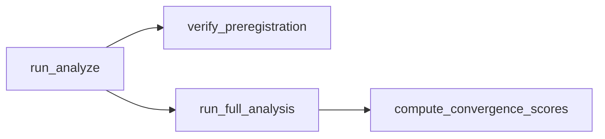

# Phase 12 gap closure plan

## Context (already in repo)

- [`src/forensics/preregistration.py`](src/forensics/preregistration.py) — `verify_preregistration(settings, lock_path=None)` returns `VerificationResult` and already logs: INFO for missing/ok, WARNING on mismatch.
- [`src/forensics/cli/analyze.py`](src/forensics/cli/analyze.py) — `run_analyze()` loads settings, optionally verifies corpus, then runs stages; **never calls** `verify_preregistration`.
- [`src/forensics/analysis/convergence.py`](src/forensics/analysis/convergence.py) — `compute_convergence_scores(..., use_permutation=False, permutation_seed=42, n_permutations=1000)`; docstring notes p-values are logged only, windows unchanged.
- Call sites for `compute_convergence_scores`: [`src/forensics/analysis/orchestrator.py`](src/forensics/analysis/orchestrator.py) (single author full analysis), [`src/forensics/analysis/comparison.py`](src/forensics/analysis/comparison.py) (control + target paths).

## 1. Pre-registration check on every analyze run

**Change:** In `run_analyze` in [`src/forensics/cli/analyze.py`](src/forensics/cli/analyze.py), after successful `--verify-corpus` (if any) and **before** `PipelineContext.record_audit` / stage dispatch, call:

`verify_preregistration(settings)` (default lock path from preregistration module).

**Behavior:** No new exit codes — rely on existing logging inside `verify_preregistration` (matches “warn, do not block exploratory runs”).

**Tests:** Add a focused unit test (e.g. in [`tests/test_preregistration.py`](tests/test_preregistration.py) or a small `tests/test_analyze_preregistration.py`) that monkeypatches `run_full_analysis` / stages to no-op and asserts `verify_preregistration` was invoked once when `run_analyze` runs with flags that reach the main path (or patch `verify_preregistration` and assert call count). Keep scope minimal.

**Optional (same PR if trivial):** Append `preregistration_status` (e.g. `ok` / `missing` / `mismatch`) to `run_metadata.json` in `_write_run_metadata` for auditability — not required for log-only spec.

## 2. Config-driven convergence permutation

**Change:** Extend [`AnalysisConfig`](src/forensics/config/settings.py) with typed fields, for example:

- `convergence_use_permutation: bool = False` — **default False** to preserve current CPU behavior and existing outputs; document in [`docs/RUNBOOK.md`](docs/RUNBOOK.md) that setting `true` enables empirical p-value logging for each convergence window (Phase 12 §5b intent).
- `convergence_permutation_iterations: int = 1000` (with sensible bounds, e.g. `ge=100`, `le=50_000` if you want guardrails).
- `convergence_permutation_seed: int = 42`.

**Wire:**

- [`src/forensics/analysis/orchestrator.py`](src/forensics/analysis/orchestrator.py) — pass `use_permutation`, `n_permutations`, `permutation_seed` from `settings.analysis` into `compute_convergence_scores`.
- [`src/forensics/analysis/comparison.py`](src/forensics/analysis/comparison.py) — same kwargs on both `compute_convergence_scores` calls (lines ~238 and ~274) so compare-only / control summaries stay consistent.

**Config.toml:** Add commented or explicit lines under `[analysis]` so operators discover the flags (match project style for other analysis knobs).

**Tests:** One unit test that enables permutation with a tiny `n_permutations` (e.g. 20) and mocks heavy inputs if needed, or asserts `compute_convergence_scores` receives `use_permutation=True` via patch — prefer extending [`tests/test_permutation.py`](tests/test_permutation.py) or a thin orchestrator/convergence test to avoid full pipeline cost.

## 3. CLI integration tests (Phase 12 §10 checklist)

Extend [`tests/integration/test_cli.py`](tests/integration/test_cli.py) with **help-only** or zero-side-effect invocations (pattern already used with `CliRunner` and `_plain_help`):

- `survey --help` (Typer sub-app: `["survey", "--help"]` — confirm actual argv from [`src/forensics/cli/__init__.py`](src/forensics/cli/__init__.py)).
- `calibrate --help`
- `preflight --help` (if sub-options exist, assert key string).
- `lock-preregistration --help` or bare invoke with monkeypatched `lock_preregistration` to tmp_path to avoid writing real lock.
- `setup --help` **or** `setup` with ImportError path if `--help` is not registered — match how `setup` is exposed.

Goal: regression guard that commands stay registered after refactors.

## 4. Explicitly deferred (unless you expand scope)

- **Full `validate_against_controls` per-feature Welch / Mann–Whitney** (Phase 12 prose in [`prompts/phase12-survey-tui-hardening/current.md`](prompts/phase12-survey-tui-hardening/current.md) §5c): current implementation is cohort summary only in [`src/forensics/survey/scoring.py`](src/forensics/survey/scoring.py). Treat as separate research task or doc amendment — not part of this minimal gap closure.
- **Plan document status:** Updating `Status: pending` → `complete` in `prompts/phase12-survey-tui-hardening/current.md` when you accept the work — optional doc-only follow-up.

## 5. Validation after implementation

Run (when executing outside Plan mode):

`uv run ruff check .` and `uv run pytest tests/ -q` (or targeted paths for speed).
