# Phase 16 — Adversarial Review Remediation

Implements every accept from `prompts/phase16-adversarial-review-remediation/current.md`. Decisions confirmed with the user:

- **Phase I is reduced to I.3 only** — capture amendments in `HANDOFF.md`, `docs/RUNBOOK.md`, `docs/GUARDRAILS.md`, and the prompt CHANGELOG. The `mediaite-ghostink-integrity-report.docx` does not exist in the workspace; we do not generate it here.
- **Phase C corpus_hash semantic = analyzable corpus** — `WHERE is_duplicate = 0 ORDER BY content_hash`.
- All Phase B operational decisions follow the prompt's documented defaults (option 1: quarantine + re-extract; opt-in `--allow-pre-phase16-embeddings` flag).

Definition-of-Done bullets that depend on the docx are dropped from K; everything else stands.

## Sequencing & TDD discipline

Correctness (A → E) lands before tooling/docs/perf (F → K). For C, D, E, F.3 the failing or pinned-regression test lands in the same commit as the fix (xfail-strict where the prompt prescribes it). Stage boundaries (`scrape → extract → analyze → report`) are not crossed.

```mermaid
flowchart LR
    A["A: hash coverage"] --> B["B: encoder revision pin"]
    B --> C["C: corpus hash v2"]
    C --> D["D: stat-test integrity"]
    D --> E["E: repo concurrency lock"]
    E --> F["F: validators + CLI wiring"]
    F --> G["G: stage-config coherence"]
    G --> H["H: defensive decode"]
    H --> J["J: perf + low-priority"]
    J --> I["I3: docs amendments"]
    I --> K["K: verify, CHANGELOG, gitnexus"]
```



## Hash break is deliberate

The analysis-config hash MUST change when A and F land. Phase A.5 ships a new GUARDRAILS Sign before any artifact is produced under the new hash. Phase 15 `*_result.json` files become incompatible with Phase 16 by design — `validate_analysis_result_config_hashes()` is the gate.

---

## Phase A — Pre-Registration Hash Coverage

`src/forensics/config/settings.py`, `src/forensics/preregistration.py`, `data/preregistration/preregistration_lock.json`, `docs/GUARDRAILS.md`.

- A.1/A.3: tag `pelt_penalty`, `bocpd_hazard_rate`, `min_articles_for_period`, `changepoint_methods`, `enable_ks_test` (verify), `bootstrap_iterations` (verify) with `json_schema_extra={"include_in_config_hash": True}` and tighten validators (`gt`, `ge`, `le`) inline. `bocpd_min_run_length` is already covered — leave alone. Per-field rationale comments are required (operational vs signal-bearing).
- A.2: add `embedding_model_revision: str = Field("main", json_schema_extra={"include_in_config_hash": True}, ...)`. Set the concrete `all-MiniLM-L6-v2` commit SHA in `config.toml` and `config.toml.example` (verify against HuggingFace before commit; the `c9745ed1d9f207416be6d2e6f8de32d1f16199bf` value in the prompt is a hint, not authoritative).
- A.4: extend `_snapshot_thresholds` in [`src/forensics/preregistration.py`](src/forensics/preregistration.py) to include `embedding_model_revision` and `enable_ks_test`, then regenerate `data/preregistration/preregistration_lock.json` via `uv run forensics preregister --template`. Verify lock has `locked_at: null` (template) and that `verify_preregistration` reports `status="missing"` for the unfilled template (existing branch at line 166).
- A.5: append the prompt's "Pre-Phase-16 locked artifacts must be re-locked" Sign to `docs/GUARDRAILS.md` and a header entry in `prompts/phase16-adversarial-review-remediation/CHANGELOG.md`.

Validation: `uv run pytest tests/ -k "config or settings or hash or preregistration" -v`.

## Phase B — Embedding Integrity

`src/forensics/features/embeddings.py`, `src/forensics/models/features.py`, `src/forensics/features/pipeline.py`, `src/forensics/analysis/drift.py`, `docs/RUNBOOK.md`.

- B.1: change [`_get_model`](src/forensics/features/embeddings.py) to `(model_name, revision)`, cache key `f"{model_name}@{revision}"`, and pass `revision=` to `SentenceTransformer(...)`. Update `compute_embedding(...)` signature to require `revision`. Threading: existing `_ST_MODEL_CACHE` already lazy-initializes; no change needed.
- B.2: add `model_revision: str` to `EmbeddingRecord` in [`src/forensics/models/features.py`](src/forensics/models/features.py:224); update the only producer at [`src/forensics/features/pipeline.py:224`](src/forensics/features/pipeline.py) to populate it from `settings.analysis.embedding_model_revision`. Keep `model_version` for legacy reads.
- B.3: there is no top-level `load_embedding`; the load happens inside `_load_embedding_row` and the `vec = _load_embedding_row(...)` call site at [`src/forensics/analysis/drift.py:397`](src/forensics/analysis/drift.py). Add a thin `validate_embedding_record(record, vec, expected_revision, *, strict)` helper next to `_load_embedding_row` that enforces:
  - `vec.shape[-1] == record.embedding_dim`
  - `record.model_revision == expected_revision`
  - In confirmatory/strict mode → raise; in exploratory + `--allow-pre-phase16-embeddings` → log warning and continue.
- B.4: default operator policy = quarantine + re-extract (option 1). Document in `docs/RUNBOOK.md` under a new "Phase 16 hash-break migration" section. Wire `--allow-pre-phase16-embeddings` through [`src/forensics/cli/analyze.py`](src/forensics/cli/analyze.py) and into the analyze orchestrator so it threads down to the validator.
- B.5: add `tests/integration/test_embedding_revision_gate.py` with two fixture batches (right vs wrong revision) confirming confirmatory raises and exploratory+flag warns.

Validation: `uv run pytest tests/unit/test_embeddings.py tests/unit/test_features.py tests/integration/test_embedding_revision_gate.py -v`.

## Phase C — Corpus Hash Determinism (v2)

`src/forensics/utils/provenance.py`, `src/forensics/models/analysis.py`, `tests/unit/test_provenance.py`, `tests/unit/test_corpus_custody_schema.py` (new).

- C.1 (TDD): add `test_corpus_hash_uuid_order_dependency_xfail` in [`tests/unit/test_provenance.py`](tests/unit/test_provenance.py) marked `@pytest.mark.xfail(strict=True, reason="Phase 16 C2 will fix")`. Asserts that two DBs with identical content but reversed insert order produce equal `compute_corpus_hash`. xfail-strict ensures it flips to expected-pass in C.2 in the same series.
- C.2: in [`src/forensics/utils/provenance.py:120`](src/forensics/utils/provenance.py), change `compute_corpus_hash` to:

```python
"SELECT content_hash FROM articles WHERE is_duplicate = 0 ORDER BY content_hash"
```

Per user choice, the v2 hash represents the *analyzable* corpus. Document the semantic in the docstring. The xfail test now passes (xfail-strict will fail the suite if you forget to remove the marker).

- C.3: introduce a `CorpusCustody` Pydantic model in `src/forensics/models/analysis.py` with `schema_version: int = 2`, `corpus_hash: str`, `corpus_hash_v1: str | None = None`, `recorded_at: datetime`. The current `write_corpus_custody` writes a free-form dict — convert to model.
- C.4: add `compute_corpus_hash_legacy` (the old `ORDER BY id` path, no `WHERE`) marked `@deprecated` in the docstring. Make `write_corpus_custody` populate both. One-cycle transition; remove in Phase 17 (tracked via the new GUARDRAILS Sign).
- C.5: update `verify_corpus_hash` to read `schema_version` and dispatch — `1` → legacy, `2` → new. Backwards-compat: missing field implies `1`. Add `tests/unit/test_corpus_custody_schema.py` with two fixtures (one per schema version) plus a tamper test.

Validation: `uv run pytest tests/unit/test_provenance.py tests/unit/test_corpus_custody_schema.py -v`.

## Phase D — Statistical Test Integrity

`src/forensics/models/analysis.py`, `src/forensics/analysis/statistics.py`, `src/forensics/analysis/convergence.py`, `tests/unit/test_statistics_nan_propagation.py` (new).

- D.1: extend [`HypothesisTest`](src/forensics/models/analysis.py) with `n_pre: int`, `n_post: int`, `n_nan_dropped: int = 0`, `skipped_reason: str | None = None`, `degenerate: bool = False`. Defaults are picked so reading legacy `*_hypothesis_tests.json` still validates (Pydantic v2 `frozen=True` is preserved). Add a small `from_legacy()` classmethod for the report stage that fills `n_pre/n_post = -1` if missing.
- D.2: in [`run_hypothesis_tests`](src/forensics/analysis/statistics.py), split-then-drop NaN per segment, log per-segment drop counts, and emit a `_skipped_test` placeholder when `len(pre) < 2 or len(post) < 2 or breakpoint invalid`. The placeholder carries `raw_p_value=NaN`, `corrected_p_value=NaN`, `significant=False`, populated `skipped_reason`/`n_pre`/`n_post`/`n_nan_dropped`.
- D.3: capture `degenerate=True` when `mannwhitneyu` raises `ValueError` (all values tied) OR `cohens_d` floors pooled std OR Welch returns NaN. Both Welch and Mann–Whitney emit separate `HypothesisTest` rows today; tag each independently.
- D.4: in `apply_correction` and `apply_correction_grouped`, partition into rankable (finite p, not skipped, not degenerate) vs non-rankable. BH denominator becomes `len(rankable)` per family. Non-rankable rows pass through with `corrected_p_value=NaN`, `significant=False`.
- D.5: in [`src/forensics/analysis/convergence.py`](src/forensics/analysis/convergence.py), use `len(rankable_features)` per family as the convergence denominator. Add `n_rankable_per_family: dict[str, int]` to the emitted convergence payload.
- D.6: `tests/unit/test_statistics_nan_propagation.py` (new) — synthetic series with injected NaNs at known indices, run `run_hypothesis_tests → apply_correction`, assert log counts, skipped_reason, BH denominator post-drop, and convergence denominator behavior.

Validation: `uv run pytest tests/unit/test_models_analysis.py tests/unit/test_statistics_nan_propagation.py -v`.

## Phase E — Repository Concurrency Enforcement

`src/forensics/storage/repository.py`, `tests/integration/test_repository_concurrency.py` (new).

- E.1: extend `Repository.__slots__` from `("_db_path", "_conn")` to include `"_lock"`; assign `self._lock = threading.Lock()` in `__init__`.
- E.2: wrap every mutating SQL path in `with self._lock:` (`upsert_article`, `upsert_author`, `mark_duplicates`/`clear_duplicate_flags` if present, plus any direct `INSERT/UPDATE/DELETE` issued from `Repository`). Also wrap `apply_migrations` invocation in `__enter__` since migrations mutate. Reads stay lock-free (WAL serializes at C level).
- E.3: `tests/integration/test_repository_concurrency.py` — 8 async writers × 100 articles via `asyncio.to_thread(repo.upsert_article, ...)`; assert exactly 800 rows, no duplicate IDs, and a concurrent reader doesn't see partial transactions (use `journal_mode=WAL` already on).
- E.4: replace the existing "callers MUST serialize externally" docstring with the new internal-lock contract; supersede the P1-SEC-001 note.

Validation: `uv run pytest tests/integration/test_repository_concurrency.py -v`.

## Phase F — Validators & CLI Wiring

`src/forensics/scraper/dedup.py`, `src/forensics/cli/scrape.py`, `src/forensics/models/article.py`, `src/forensics/config/settings.py`, `src/forensics/storage/migrations/003_articles_word_count_check.py` (new), `tests/integration/test_repository_migrations.py`, `tests/unit/test_settings.py`.

- F.1: drop the hardcoded `_NEAR_DUP_HAMMING = 3` default in [`src/forensics/scraper/dedup.py:136`](src/forensics/scraper/dedup.py); make `hamming_threshold` resolve from `settings.scraping.simhash_threshold` (already wired at [`src/forensics/cli/scrape.py:201`](src/forensics/cli/scrape.py); the lib default just becomes the same value via `get_settings()` fallback so direct callers stay safe).
- F.2: tighten validators on `Article.word_count` (`Field(0, ge=0)`) and `AnalysisConfig` knobs (`pelt_penalty gt=0`, `bocpd_hazard_rate gt=0 le=1`, `min_articles_for_period ge=1`). Run repo grep against `config.toml` fixtures to confirm no negative values exist.
- F.3: add migration `003_articles_word_count_check.py` (Python migration, matching the existing 001/002 style — not raw SQL). Use the rename-+-recreate-+-copy pattern. Verify column list against canonical `_SCHEMA` in [`src/forensics/storage/repository.py`](src/forensics/storage/repository.py); the `articles` schema does **not** include `is_shared_byline` (that's on `authors`) — the prompt's snippet is incorrect on this point and will be fixed during execution.
- F.4: add `ChangepointMethod = Literal["pelt", "bocpd", "chow", "cusum"]` and re-type `changepoint_methods: list[ChangepointMethod]`. Add unit test asserting `AnalysisConfig(changepoint_methods=["typo"])` raises `ValidationError`.
- F.5: add hash-coverage smoke tests in `tests/unit/test_settings.py` — for each newly hashed knob (`pelt_penalty`, `bocpd_hazard_rate`, `min_articles_for_period`, `embedding_model_revision`, `changepoint_methods`, `enable_ks_test` if not yet covered), construct two configs differing only on that field and assert `compute_analysis_config_hash` differs.

Validation: `uv run pytest tests/integration/test_repository_migrations.py tests/unit/test_settings.py -v`.

## Phase G — Stage-Config Coherence

`src/forensics/config/settings.py`.

- G.1: add `@model_validator(mode="after")` on `ForensicsSettings` enforcing `self.features.excluded_sections == self.survey.excluded_sections`. Default = strict; deferred override flag is not implemented (prompt's "for now the safer default is to require coherence"). Add `tests/unit/test_settings.py::test_excluded_sections_coherence` for the failure path and a passing baseline.

Validation: `uv run pytest tests/unit/test_settings.py -k excluded_sections -v`.

## Phase H — Defensive Decode in Confirmatory Mode

`src/forensics/models/features.py`, `src/forensics/analysis/orchestrator.py`, `tests/unit/test_features_strict.py` (new).

- H.1: replace `_maybe_decode_dict_field` silent `{}` fallback with `(strict=False)` parameter; default logs WARNING with a payload prefix; `strict=True` raises `ValueError`.
- H.2: introduce a `ContextVar[bool]` `STRICT_DECODE_CTX` exposed from `forensics.models.features`; the analyze orchestrator sets it to `True` after `verify_preregistration` returns `status="ok"`. The `model_validator` reads the ContextVar and forwards `strict=` to the helper. Avoids changing every model field declaration.
- H.3: `tests/unit/test_features_strict.py` — corrupted JSON payload; assert default mode warns + returns `{}`; assert ContextVar-true mode raises.

Validation: `uv run pytest tests/unit/test_features_strict.py -v`.

## Phase J — Performance & Low-Priority Defenses

`src/forensics/analysis/timeseries.py`, `src/forensics/analysis/changepoint.py` (or wherever `chow_test` is — currently in `timeseries.py` per grep), `src/forensics/scraper/parser.py`, `docs/RUNBOOK.md`.

- J.1: refactor `compute_rolling_stats` in [`src/forensics/analysis/timeseries.py:26`](src/forensics/analysis/timeseries.py) to a single `with_columns` over `[mean_w, std_w]` per window; preserve current output shape and NaN handling (existing `tests/unit/test_timeseries.py` is the regression gate — must pass unchanged).
- J.2: add "Dedup performance cliff above hamming_threshold = 3" section to `docs/RUNBOOK.md`.
- J.3: add range guard at [`chow_test`](src/forensics/analysis/timeseries.py:92) — `if not 1 <= breakpoint_idx < n - 1: raise ValueError(...)`. Note: existing implementation silently returns `(0.0, 1.0)` for invalid breakpoints; tighten to explicit raise. Update any caller that relies on the silent fallback (grep `chow_test\(`).
- J.4: add `_assert_sorted_timestamps(timestamps, fn_name)` helper in `timeseries.py`; call from `stl_decompose` only (`chow_test` does not take timestamps in the current signature).
- J.5: in [`src/forensics/scraper/parser.py`](src/forensics/scraper/parser.py), add explicit `if not clean_text.strip() or word_count == 0: log + return None` check before `Article` construction so empty articles are filtered with an audit-trail reason instead of being collapsed by simhash on `\x00`. Verify with `tests/unit/test_parser.py -k empty_content` (add if missing).

Validation: `uv run pytest tests/unit/test_timeseries.py tests/unit/test_parser.py -v`.

## Phase I (reduced) — In-repo Documentation

User-confirmed scope: skip the `.docx`. Capture in repo-only files.

- I.3 only: append a "Phase 16 hash-break migration" section to `docs/RUNBOOK.md` (template regen, lock verification, embedding policy options, transition cycle for `corpus_hash_v1`/`corpus_hash`); append the Phase-16 completion block to `HANDOFF.md`; ensure the Sign added in A.5 is present in `docs/GUARDRAILS.md`; note in `prompts/phase16-adversarial-review-remediation/CHANGELOG.md` the four claims now backed by enforceable code.

Validation: read each doc back to confirm.

## Phase K — Verification, CHANGELOG, gitnexus refresh

- K.1: `uv run ruff check . && uv run ruff format --check . && uv run pytest tests/ -v --cov=src --cov-report=term-missing` — coverage ≥ 75 % on `src/forensics`.
- K.2: end-to-end fixture pipeline (`scrape FETCH_ONLY → extract → analyze --exploratory → report`) on a known small slug; inspect that:
  - `<slug>_result.json` carries the new analysis-config hash
  - `corpus_custody.json` has `schema_version=2` plus both `corpus_hash` and `corpus_hash_v1`
  - `<slug>_hypothesis_tests.json` carries `n_pre/n_post/degenerate/skipped_reason/n_nan_dropped`
  - `<slug>_convergence.json` carries `n_rankable_per_family`
- K.3: confirmatory regression — regenerate template, fill it via `forensics preregister --lock`, run analyze without `--exploratory`, then mutate one field and confirm hard-fail with `preregistration_status="mismatch"`.
- K.4: update `prompts/phase16-adversarial-review-remediation/CHANGELOG.md` (MAJOR/MINOR/PATCH/DOCS bucketing per the prompt) and bump `versions.json` to `0.2.0`.
- K.5: append the Phase-16 completion block to `HANDOFF.md` per CLAUDE.md contract (status, files changed, decisions, unresolved, next steps, verification commands + summarized output).
- K.6: confirm GUARDRAILS Sign present (added in A.5).
- K.7: `npx gitnexus analyze --embeddings` (preserves existing embeddings; `.gitnexus/meta.json` will gate this — confirm count > 0 first per CLAUDE.md instructions).

## Out of Scope

The 9 Phase-B rejects (R6, R7-lazy, R12, R14, R16, R17, R24, R25, R26) and the docx amendments. All listed in the prompt's "Out of Scope (Builder Rebuttals)" section and the user-confirmed Phase I reduction.

## Risk-classified summary

- **HIGH**: B.1 (model loader signature change, propagates), D.2/D.4 (statistical test contract change), F.3 (migration touches articles), C.2 (hash break is intentional)
- **MEDIUM**: B.4 (operational pre-pin policy), D.3, D.5, E.1/E.2, F.2
- **LOW**: A, F.1, F.4, F.5, G, H, J, I.3, K
