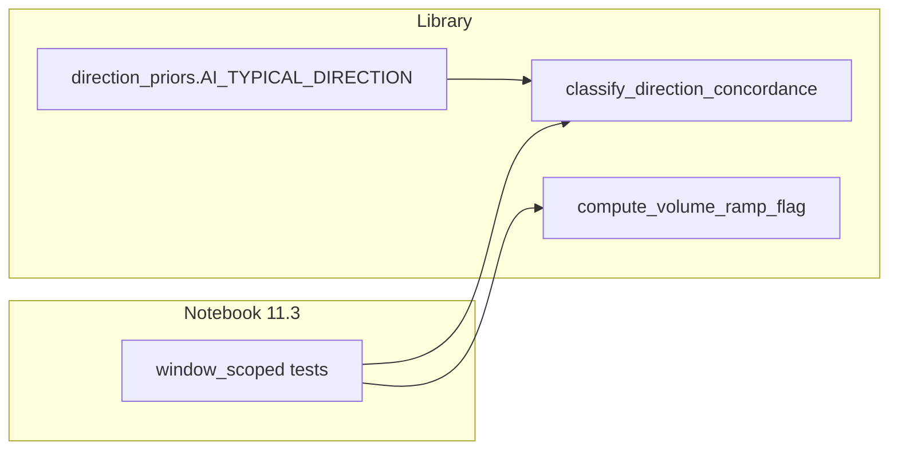

# Phase 17: Classifier direction + volume diagnostics — implementation plan

Source of truth: [prompts/phase17-classifier-direction-volume-diagnostics/current.md](prompts/phase17-classifier-direction-volume-diagnostics/current.md) (v0.1.0).

## Scope recap

- **In scope:** Additive diagnostics only (`DirectionConcordance`, `VolumeRampFlag`, breakdown dataclass, priors dict, notebook columns + §11.3.1 + recommendation line, tests, [docs/RUNBOOK.md](docs/RUNBOOK.md), [HANDOFF.md](HANDOFF.md), conditional [docs/GUARDRAILS.md](docs/GUARDRAILS.md) Sign).
- **Frozen:** [`classify_finding_strength`](src/forensics/models/report.py) logic and [`FindingStrength`](src/forensics/models/report.py) enum semantics (no signature or tier-rule changes).
- **Explicitly out of scope per prompt:** Pre-registration lock file edits, re-classifying authors, PDF generation as a committed artifact, pipeline stages scrape/features/core-analysis.

## Contradictions / repo facts to bake in

1. **`direction_priors.py` location vs “no `analysis/` edits”**  
   The prompt’s Guiding Principle #5 forbids edits to `src/forensics/scraper/`, `features/`, and `analysis/` *pipeline* modules, but Phase A names [`src/forensics/analysis/direction_priors.py`](src/forensics/analysis/direction_priors.py). **Resolution:** Add **only** this file as a **pure-data** module: stdlib + `typing` only, **no** imports from changepoint/drift/embeddings or other `forensics.analysis` submodules. If Claude hooks flag “domain purity” on new files under `analysis/`, escalate once; fallback is moving the same content to `src/forensics/models/direction_priors.py` and adjusting imports—**only if** a hook blocks merge (preserves architecture rule intent).

2. **`n_pre` / `n_post` are not optional floats**  
   [`HypothesisTest`](src/forensics/models/analysis.py) uses `int` with default **`-1`** for unknown/legacy (`from_legacy` documents this). `compute_volume_ramp_flag` must treat **`None` is impossible on the model** but JSON loaders may still produce missing keys defaulted via `from_legacy`; treat **`n_pre <= 0` or `n_post < 0` or `-1`** as unusable for ratio (map to `VolumeRampFlag.UNKNOWN`, `volume_ratio=None`). This satisfies the prompt’s div-by-zero Sign without fighting Pydantic.

3. **`data/analysis/*` is gitignored** (see [.gitignore](.gitignore))  
   Integration tests **cannot** rely on local `data/analysis/{slug}_result.json` in CI. **Required adjustment:** Add **committed** minimal fixtures under e.g. `tests/fixtures/phase17/` (trimmed `AnalysisResult` JSON or hand-built `HypothesisTest`/`ConvergenceWindow` factories) capturing the Apr 27 expected verdicts for **Colby Hall + eight MODERATE slugs** (prompt lists slugs). Document in test module that full `*_result.json` can be used locally for refresh/regen of expected tuples if analysis is re-run.

4. **Enum string values vs narrative labels**  
   Prompt prose uses names like `DIRECTION_AI`; implementation uses `StrEnum` members whose **values** are `direction_ai`, etc. Notebook and tables should display **enum values** (or `.name`) consistently with Phase C1.

## Implementation sequence (with risk)

### Phase A — Direction priors (LOW)

| Step | Action |
|------|--------|
| A1 | Create [`src/forensics/analysis/direction_priors.py`](src/forensics/analysis/direction_priors.py) exactly as specified in the prompt: module docstring (exploratory until pre-reg lock), `AI_TYPICAL_DIRECTION`, `direction_from_d` with None/NaN/zero handling. |
| A2 | Add [`tests/unit/test_direction_priors.py`](tests/unit/test_direction_priors.py): `direction_from_d` cases; keys are intentional (document `hedging_frequency=None`); **audit test** that every dict key is either (a) a `feature_name` that appears in real analysis outputs, or (b) justified—implement by maintaining a small **allowlist** built from grep of tests + [`HypothesisTest`](src/forensics/models/analysis.py) usage / fixture corpus, or by flattening public scalar field names from [`FeatureVector`](src/forensics/models/features.py) nested models (pick one approach and stick to it so new features force a test update). |

**GitNexus (execution phase):** Before editing [`report.py`](src/forensics/models/report.py), run upstream `impact` on `classify_finding_strength` only if touching it (should be **no touch**); run `impact` on new symbols in `report.py` after adding them.

### Phase B — Concordance + volume in `report.py` (LOW)

| Step | Action |
|------|--------|
| B1 | Extend [`src/forensics/models/report.py`](src/forensics/models/report.py): `from dataclasses import dataclass`; import `AI_TYPICAL_DIRECTION` and `direction_from_d` from `forensics.analysis.direction_priors`; add `DirectionConcordance` (`direction_ai` / `direction_mixed` / `direction_non_ai` / `direction_na`), frozen `DirectionBreakdown`, `classify_direction_concordance(window, tests) -> tuple[...]`. **Logic:** group tests by `feature_name`; per feature keep test with max `abs(effect_size_cohens_d)` among passed-in list; compare `direction_from_d` to prior; count match/oppose/no_prior; **≥50%** of (match+oppose) match ⇒ AI; >0 and <50% ⇒ MIXED; 0% match with ≥1 prior feature ⇒ NON_AI; no priors for any feature ⇒ NA. Document 50% threshold as exploratory in docstring. `convergence_window` parameter: use for optional debug assertion or doc-only “caller must scope”—do not silently filter unless you add explicit `validate_window_scope` (prefer **caller contract** matching `classify_finding_strength` docstring). |
| B2 | Same file: `VolumeRampFlag` (`volume_stable` / `volume_growth` / `volume_ramp` / `volume_decline` / `volume_unknown`), `compute_volume_ramp_flag(tests) -> tuple[VolumeRampFlag, float | None]`. Use **first non-degenerate** test with usable `n_pre>0` and `n_post>=0` (and not `-1`). Thresholds: stable `[0.5, 2.0]`, growth `(2, 5]`, ramp `>5`, decline `<0.5`, else unknown. Docstring: heterogeneous lists use first usable pair; exploratory 5×. |
| B3 | Update [`src/forensics/models/__init__.py`](src/forensics/models/__init__.py): import + export `DirectionConcordance`, `DirectionBreakdown`, `VolumeRampFlag`, `classify_direction_concordance`, `compute_volume_ramp_flag`; extend `__all__`. |

**Unit tests (prompt names):** Add [`tests/unit/test_direction_concordance.py`](tests/unit/test_direction_concordance.py) and [`tests/unit/test_volume_ramp_flag.py`](tests/unit/test_volume_ramp_flag.py) covering boundaries: all `None` priors, ties on \|d\|, zero d, empty list, `-1` sample counts, all degenerate, `n_pre=0`, inconsistent n across rows (first-wins behavior).

### Phase C — Notebook (MEDIUM for JSON fragility)

| Step | Action |
|------|--------|
| C1 | Edit notebook id **`cell-strength-code`** in [notebooks/09_full_report.ipynb](notebooks/09_full_report.ipynb) via **`EditNotebook`** or a checked-in `nbformat` script** (prompt forbids raw JSON text edit). After `classify_finding_strength`, call `classify_direction_concordance(best_window, window_tests)` and `compute_volume_ramp_flag(window_tests)`; extend row dict with `direction`, `dir_match`, `dir_oppose`, `dir_no_prior`, `volume_flag`, `volume_ratio` (rounded). **Sort ranks:** map strength → int rank; direction enum → rank (AI best); volume flag rank (STABLE best, RAMP worst per prompt intent); sort key `(strength_rank, direction_rank, volume_flag_rank, -pb)` as specified. Column order for `display`: align with prompt’s list (`slug`, `strength`, `direction`, `volume_flag`, `pa`, `pb`, `window_start`, `window_end`, `n_families`, `dir_match`, `dir_oppose`, `n_sig`, `volume_ratio`) — reconcile `n_families` vs existing column names in the cell (rename only if needed for consistency). |
| C2 | Insert markdown cell **`cell-direction-md`** after **`cell-strength-md`**: explain diagnostics, Colby vs 8 MODERATE narrative, **explicit exploratory** language for 50% and 5× thresholds, pointer to §11.1 caveats. |
| C3 | Patch **`cell-recommendations`**: add bullet locking priors + 5× threshold in `data/preregistration/preregistration_lock.json` before external publication. |

**Smoke:** `uv run jupyter nbconvert --to notebook --execute notebooks/09_full_report.ipynb --output /tmp/09_full_report_check.ipynb` (requires dev/jupyter deps as today).

### Phase D — Integration + docs (LOW)

| Step | Action |
|------|--------|
| D1 | Add [`tests/integration/test_phase17_classification.py`](tests/integration/test_phase17_classification.py) loading **committed** fixtures; assert direction + volume flags (and optionally strength) for nine authors. Treat **isaac-schorr** as **MIXED** if that matches recomputed logic—**golden values** should be produced once from a local full analysis run, then copied into the fixture file so CI is deterministic. |
| D2 | [docs/RUNBOOK.md](docs/RUNBOOK.md): new subsection “Phase 17 diagnostic columns” — meanings of enums, confound interpretation for `volume_ramp`, note thresholds exploratory; TODO for future env/CLI override if not implemented. |
| D3 | [HANDOFF.md](HANDOFF.md): completion block per AGENTS/CLAUDE contract with files, decisions, unresolved pre-reg, commands run. |
| D4 | [docs/GUARDRAILS.md](docs/GUARDRAILS.md): append Sign **only if** implementation discovers a recurring footgun (e.g. `-1` sample counts, degenerate-only windows). |

## Verification checklist (executor runs)

- `uv run pytest tests/unit/test_direction_priors.py tests/unit/test_direction_concordance.py tests/unit/test_volume_ramp_flag.py tests/integration/test_phase17_classification.py -v`
- `uv run pytest tests/ -v`
- `uv run ruff check .` and `uv run ruff format --check .`
- Optional coverage: `uv run pytest tests/ -v --cov=src --cov-report=term-missing`
- Notebook nbconvert execute (above)
- **GitNexus:** `gitnexus_impact` on modified public symbols in `report.py` / `__init__.py`; before any commit, `gitnexus_detect_changes` scope `staged` or `all` per workspace rules

## Acceptance mapping (Definition of Done from prompt)

| DoD item | Plan hook |
|-----------|-----------|
| Priors module + tests | Phase A |
| `report.py` enums + functions + `__init__.py` | Phase B |
| Unit tests (3 modules) | A2 + B unit files |
| Notebook columns + §11.3.1 + recommendations | Phase C |
| Integration golden tests | D1 + fixtures |
| RUNBOOK / HANDOFF / conditional GUARDRAILS | Phase D |

No changes to preregistration JSON, no author filtering, no `FindingStrength` edits.
