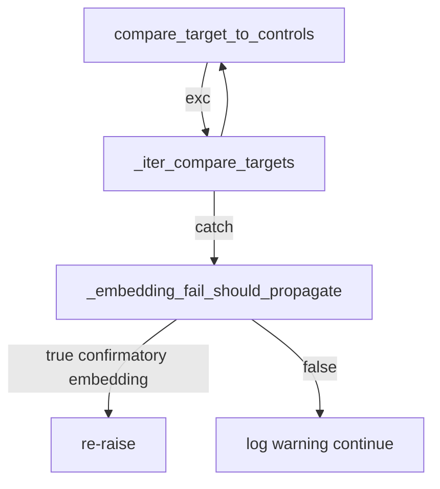

# Plan: pipeline_b hash migration, diagnostics contracts, and follow-ups

## Context (already in repo)

- [`HypothesisConfig.pipeline_b_mode`](src/forensics/config/analysis_settings.py) defaults to **`percentile`** and is **`include_in_config_hash: True`**, so any on-disk `data/analysis/<slug>_result.json` produced under the old effective default (`legacy` unless TOML set) will have a **different** `config_hash` than current settings.
- [`_validate_compare_artifact_hashes`](src/forensics/analysis/orchestrator/comparison.py) calls [`validate_analysis_result_config_hashes`](src/forensics/utils/provenance.py), which raises **`ValueError`** with a consolidated message on missing / invalid / mixed / mismatched hashes.
- [`_iter_compare_targets`](src/forensics/analysis/orchestrator/comparison.py) catches **`(ValueError, OSError)`** only — so **`EmbeddingRevisionGateError`** (subclass of `ValueError`) is **logged and skipped**, while **`EmbeddingDriftInputsError`** (`RuntimeError`) **bubbles** and can abort the run. That disagrees with [`_embedding_fail_should_propagate`](src/forensics/analysis/orchestrator/parallel.py) (confirmatory: re-raise both embedding error types).
- [`compute_probability_pipeline_score`](src/forensics/analysis/convergence.py) pulls perplexity, burstiness, and Binoculars through **`_monthly_values_in_window`**, which keys off **each series’ own** month keys via [`iter_months_in_window`](src/forensics/analysis/monthkeys.py) — **no index alignment** between `monthly_perplexity` and `monthly_binoculars` is required. Skipping null Binoculars months in [`_aggregated_trajectory`](src/forensics/analysis/probability_trajectories.py) is consistent with that design.

---

## TASK-1 — Document `pipeline_b_mode` hash break and operator migration

**Exec mode:** sequential  
**Model:** claude-sonnet-4-6  
**Model rationale:** ops copy must be precise and match provenance behavior.  
**Est. tokens:** ~20K

1. **RUNBOOK** — Add a short subsection under [docs/RUNBOOK.md](docs/RUNBOOK.md) (near the existing analysis-defaults bullet ~L7) describing:
   - Why hashes changed (default `legacy` → `percentile` while field remains hash-participating).
   - **Remediation:** re-run `forensics analyze` (full cohort) so all `*_result.json` pick up the new `config_hash`, or pin `pipeline_b_mode = "legacy"` in `config.toml` if intentionally reproducing old Pipeline B.
   - Symptom pointer: `Analysis artifact compatibility failed` / `stale or mismatched analysis config hashes` from compare/report paths.
2. **HANDOFF** — Append one completion block per [AGENTS.md](AGENTS.md) naming artifacts: per-author `data/analysis/<slug>_result.json`, anything downstream that calls `_validate_compare_artifact_hashes` / `validate_analysis_result_config_hashes` (e.g. `comparison_report.json` rebuild), and optional `run_metadata.json` / prereg notes if you mention operator workflow.

**Risk:** LOW (documentation only).

---

## TASK-2 — Integration test: hash mismatch rejection

**Exec mode:** sequential[after: TASK-1]  
**Model:** gpt-5-3-codex  
**Model rationale:** small fixture + pytest, mirrors existing integration style.  
**Est. tokens:** ~15K

- Add **`tests/integration/test_analysis_config_hash_gate.py`** (or extend an existing integration file if you prefer fewer files) that:
  - Builds a temp layout with `AnalysisArtifactPaths`, minimal `ForensicsSettings` (reuse patterns from [tests/integration/test_pipeline_end_to_end.py](tests/integration/test_pipeline_end_to_end.py) / [tests/unit/test_config_hash.py](tests/unit/test_config_hash.py)).
  - Writes minimal valid `{"config_hash": "deadbeefcafebabe"}` JSON to `analysis_dir / "fixture-target_result.json"` (and control if the validator requires both slugs).
  - Asserts **`validate_analysis_result_config_hashes`** returns `(False, ...)` **or** that **`_validate_compare_artifact_hashes`** raises **`ValueError`** with substring checks for `config_hash` / mismatch (import from `forensics.analysis.orchestrator.comparison` is acceptable for a black-box gate test).
- **Override path:** There is **no** current env/flag to “accept” stale hashes in code; if product wants an override, that would be a **separate HIGH-risk** change to `validate_analysis_result_config_hashes` / CLI — **out of scope** unless you explicitly request it. The test should document “fix = re-analyze or set `pipeline_b_mode = legacy` consistently.”

**Risk:** LOW.

---

## TASK-3 — `classify_direction_concordance` contract

**Exec mode:** sequential[after: TASK-2]  
**Model:** claude-sonnet-4-6  
**Model rationale:** behavioral contract + unit test updates.  
**Est. tokens:** ~25K

**Recommendation (matches [`classify_finding_strength`](src/forensics/models/report.py) doc):** Filter `window_hypothesis_tests` to features in **`convergence_window.features_converging`** when that list is **non-empty**; when **empty**, keep current behavior (use all passed tests) to avoid silently dropping data for odd callers.

- Implement filter **before** `_collapse_tests_by_max_abs_d`.
- Remove the dead `_ = convergence_window` pattern; update docstring to state the scoping rule explicitly.
- Update [tests/unit/test_direction_concordance.py](tests/unit/test_direction_concordance.py) and [tests/integration/test_phase17_classification.py](tests/integration/test_phase17_classification.py) if their fixtures pass tests outside `features_converging`.
- Notebook [notebooks/09_full_report.ipynb](notebooks/09_full_report.ipynb): confirm the call still passes window-scoped tests (should already match `best` window); adjust only if filtering changes visible counts.

**Risk:** MEDIUM (changes exploratory diagnostic inputs).

**GitNexus:** Run `gitnexus_impact` on `classify_direction_concordance` before editing (workspace rule).

---

## TASK-4 — Embedding error propagation in `_iter_compare_targets`

**Exec mode:** parallel with TASK-3 only if different authors split work; else sequential[after: TASK-3]  
**Model:** claude-sonnet-4-6  
**Est. tokens:** ~15K

In [src/forensics/analysis/orchestrator/comparison.py](src/forensics/analysis/orchestrator/comparison.py):

- Import `EmbeddingDriftInputsError`, `EmbeddingRevisionGateError` and **`_embedding_fail_should_propagate`** (prefer **importing the helper** from [`parallel.py`](src/forensics/analysis/orchestrator/parallel.py) to avoid duplicating policy, or move `_embedding_fail_should_propagate` to a tiny shared module like `orchestrator/embedding_errors.py` if you want to avoid `parallel` ↔ `comparison` coupling — **pick one**; smallest diff is import-from-parallel).
- In the `except` block around `compare_target_to_controls`, **`raise` without logging** when `_embedding_fail_should_propagate(mode, exc)` is true; otherwise keep today’s warning + `continue` for generic `ValueError`/`OSError`.

Add/adjust a unit test that simulates an exception type hierarchy (can use `pytest.raises` with a monkeypatched `compare_target_to_controls` if real drift setup is heavy).

**Risk:** MEDIUM (changes failure visibility on compare-only / full runs).

**GitNexus:** Impact on `_iter_compare_targets` and `compare_target_to_controls` callers.

---

## TASK-5 — Pipeline C trajectory verification (items 5–6)

**Exec mode:** sequential[after: TASK-4]  
**Model:** gpt-5-3-codex  
**Est. tokens:** ~15K

- **Item 5:** Add a focused unit test in [tests/unit/test_probability_trajectories.py](tests/unit/test_probability_trajectories.py) (or new file) where **January has `binoculars_score=None`**, February has a float, assert `monthly_binoculars` length **<** `monthly_perplexity` and that **`compute_probability_pipeline_score`** returns a stable finite value for a window spanning both months (documents the “no parallel list” invariant). Optionally add a one-line comment in [`probability_trajectories.py`](src/forensics/analysis/probability_trajectories.py) near the None-skip loop explaining **sparse bx months are OK**.
- **Item 6:** Document in the same test (comment) or in [docs/settings_phase15.md](docs/settings_phase15.md) / module docstring: **`mean().alias("avg_ppl")` over articles in a month = equal weight per article**, not token-weighted — aligns with Pipeline C “monthly stylometry snapshot” semantics; flag if product ever needs token weighting (would be HIGH-risk schema/spec change).

**Risk:** LOW.

---

## TASK-6 — Delivery: separate PRs / commits (item 7)

**Exec mode:** sequential (meta; no code)  
**Model:** cursor-auto  
**Est. tokens:** ~5K

Recommended **commit/PR boundaries** (each passes `uv run ruff check .` + targeted `pytest`):

1. Docs + HANDOFF + hash integration test (**TASK-1–2**).
2. `classify_direction_concordance` + tests + notebook touch if needed (**TASK-3**).
3. Comparison embedding propagation + tests (**TASK-4**).
4. Probability trajectory tests/docs (**TASK-5**).
5. **Isolated existing workstreams** you listed: AnalysisMode threading, `pipeline_b_mode` default (if not already on branch), Pipeline C loader, Phase 17 diagnostics, `compat_analysis` extraction, notebook output strip — **one PR each** or **one commit each** on a single PR with clear messages.

**Risk:** LOW (process).

---

## TASK-7 — `.cursor/plans/*.md` in git (item 8)

**Exec mode:** sequential  
**Model:** claude-haiku-4-5  
**Est. tokens:** ~5K

- [.gitignore](.gitignore) currently **does not** ignore `.cursor/plans/` (only `.cursor/hooks/state/`).
- **Decision:** Either (A) **keep tracking** plans as team artifacts — document in RUNBOOK or AGENTS “plans under `.cursor/plans` are intentional,” or (B) **stop tracking** — add `.cursor/plans/*.md` (or entire `.cursor/plans/`) to `.gitignore` and `git rm --cached` tracked plan files once agreed.

**Use AskQuestion** if maintainers disagree; default recommendation: **ignore ephemeral Cursor plans** unless you actively use them as release artifacts.

**Risk:** LOW.

---

## TASK-8 — Nice-to-haves (items 9–11)

**Exec mode:** parallel  
**Model:** grok-code (small edits)  
**Est. tokens:** ~10K

| Item | Action |
|------|--------|
| **9** | In [src/forensics/models/direction_priors.py](src/forensics/models/direction_priors.py), replace `cohens_d == cohens_d` with `not math.isnan(cohens_d)` inside the existing `try` / `TypeError` pattern; add `import math`. |
| **10** | [tests/unit/test_volume_ramp_flag.py](tests/unit/test_volume_ramp_flag.py): add **`n_post=200001`, `n_pre=100000`** (ratio **2.0001**) → **GROWTH**; optionally **`5.0001`** → **RAMP** if you want open-boundary clarity. [test_direction_concordance.py](tests/unit/test_direction_concordance.py) already covers **50% tie → AI** (`test_fifty_percent_threshold_two_features_one_one_is_ai`). |
| **11** | Extend [src/forensics/models/direction_priors.py](src/forensics/models/direction_priors.py) with a parallel map **`AI_TYPICAL_DIRECTION_RATIONALE: dict[str, str]`** (or per-key `#:` comments + a test that parses them — map is easier for tests). Extend [tests/unit/test_direction_priors.py](tests/unit/test_direction_priors.py) so every **non-`None`** prior has a **non-empty** rationale string (and optionally `None` keys must say `"mixed evidence"` or similar). Keeps `test_ai_typical_direction_keys_are_audited` as the PELT gate while giving reviewers traceability. |

**Risk:** LOW.

---

## Mermaid — compare path vs embedding policy

---

## Validation commands (after implementation)

- `uv run ruff check . && uv run ruff format --check .`
- `uv run pytest tests/unit/test_direction_concordance.py tests/unit/test_volume_ramp_flag.py tests/unit/test_probability_trajectories.py tests/unit/test_direction_priors.py -v`
- `uv run pytest tests/ -m integration -v --no-cov` (includes new hash gate test)
- **GitNexus:** `gitnexus_impact` for each edited symbol; `gitnexus_detect_changes` before commit (per workspace rules).
