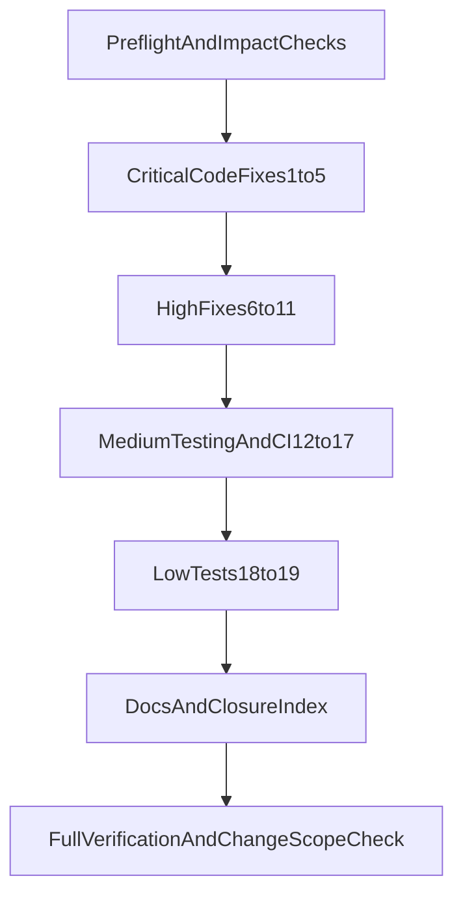

# PR94 Full Remediation Plan

## Scope
Implement **all** fixes defined in [prompts/pr94-review-remediation/current.md](/Users/johneakin/PyCharmProjects/mediaite-ghostink/prompts/pr94-review-remediation/current.md), regardless of tier, on branch `notion-review-refactor-run10`.

## Execution Graph

## Task Annotations

Task ID: TASK-1  
Title: Preflight and symbol impact map  
Exec mode: sequential  
Model: gpt-5-3-codex  
Model rationale: Fast repo-wide planning plus symbol-by-symbol safety checks before edits.  
Est. tokens: <10K  
- Capture baselines from [prompts/pr94-review-remediation/current.md](/Users/johneakin/PyCharmProjects/mediaite-ghostink/prompts/pr94-review-remediation/current.md): lint/test status and branch context.  
- For each symbol to be edited, run GitNexus impact analysis first and record blast radius and risk.

Task ID: TASK-2  
Title: Critical resilience and atomicity fixes  
Exec mode: sequential[after: TASK-1]  
Model: gpt-5-3-codex  
Model rationale: Focused implementation in orchestrator/storage paths with minimal architectural change.  
Est. tokens: ~50K  
- Implement items 1-3 in orchestrator/storage:
  - [src/forensics/analysis/orchestrator/parallel.py](/Users/johneakin/PyCharmProjects/mediaite-ghostink/src/forensics/analysis/orchestrator/parallel.py)
  - [src/forensics/storage/parquet.py](/Users/johneakin/PyCharmProjects/mediaite-ghostink/src/forensics/storage/parquet.py)
  - [src/forensics/analysis/orchestrator/per_author.py](/Users/johneakin/PyCharmProjects/mediaite-ghostink/src/forensics/analysis/orchestrator/per_author.py)
- Add/extend tests:
  - [tests/unit/test_isolated_refresh_resilience.py](/Users/johneakin/PyCharmProjects/mediaite-ghostink/tests/unit/test_isolated_refresh_resilience.py)
  - [tests/unit/test_storage_parquet.py](/Users/johneakin/PyCharmProjects/mediaite-ghostink/tests/unit/test_storage_parquet.py)
  - [tests/unit/test_per_author_empty_filter.py](/Users/johneakin/PyCharmProjects/mediaite-ghostink/tests/unit/test_per_author_empty_filter.py)

Task ID: TASK-3  
Title: Simhash versioning and migration command  
Exec mode: sequential[after: TASK-1]  
Model: gpt-5-3-codex  
Model rationale: Multi-file correctness task touching hashing, repository reads, and CLI wiring.  
Est. tokens: ~50K  
- Implement item 4 in:
  - [src/forensics/utils/hashing.py](/Users/johneakin/PyCharmProjects/mediaite-ghostink/src/forensics/utils/hashing.py)
  - [src/forensics/scraper/dedup.py](/Users/johneakin/PyCharmProjects/mediaite-ghostink/src/forensics/scraper/dedup.py)
  - dedup repository/load paths and CLI command modules under [src/forensics/cli/](/Users/johneakin/PyCharmProjects/mediaite-ghostink/src/forensics/cli/)
- Add migration tests in [tests/unit/test_simhash_migration.py](/Users/johneakin/PyCharmProjects/mediaite-ghostink/tests/unit/test_simhash_migration.py).

Task ID: TASK-4  
Title: Orchestrator patch-surface propagation contract  
Exec mode: sequential[after: TASK-1]  
Model: gpt-5-3-codex  
Model rationale: Requires careful symbol export/monkeypatch behavior alignment.  
Est. tokens: <10K  
- Implement item 5 in [src/forensics/analysis/orchestrator/__init__.py](/Users/johneakin/PyCharmProjects/mediaite-ghostink/src/forensics/analysis/orchestrator/__init__.py).
- Add coverage in [tests/unit/test_orchestrator_patch_surface.py](/Users/johneakin/PyCharmProjects/mediaite-ghostink/tests/unit/test_orchestrator_patch_surface.py).

Task ID: TASK-5  
Title: High-tier orchestrator/statistics hardening  
Exec mode: parallel  
Model: gpt-5-3-codex  
Model rationale: Independent high-tier fixes across runner/comparison/statistics/callers can be partitioned safely.  
Est. tokens: ~50K  
- Implement items 6-11 across:
  - [src/forensics/analysis/orchestrator/runner.py](/Users/johneakin/PyCharmProjects/mediaite-ghostink/src/forensics/analysis/orchestrator/runner.py)
  - [src/forensics/analysis/orchestrator/comparison.py](/Users/johneakin/PyCharmProjects/mediaite-ghostink/src/forensics/analysis/orchestrator/comparison.py)
  - [src/forensics/analysis/statistics.py](/Users/johneakin/PyCharmProjects/mediaite-ghostink/src/forensics/analysis/statistics.py)
  - [src/forensics/analysis/changepoint.py](/Users/johneakin/PyCharmProjects/mediaite-ghostink/src/forensics/analysis/changepoint.py) and direct callers
- Add/extend tests for BH stability, single-author correction behavior, detect_pelt input guards.

Task ID: TASK-6  
Title: CI and integration reliability remediation  
Exec mode: sequential[after: TASK-5]  
Model: gpt-5-3-codex  
Model rationale: Workflow + integration fixtures need ordered edits and validation together.  
Est. tokens: ~50K  
- Implement items 12-15 in:
  - [pyproject.toml](/Users/johneakin/PyCharmProjects/mediaite-ghostink/pyproject.toml)
  - [.github/workflows/ci-tests.yml](/Users/johneakin/PyCharmProjects/mediaite-ghostink/.github/workflows/ci-tests.yml)
  - [tests/integration/test_pipeline_end_to_end.py](/Users/johneakin/PyCharmProjects/mediaite-ghostink/tests/integration/test_pipeline_end_to_end.py)
  - [tests/unit/test_scraper_gather_resilience.py](/Users/johneakin/PyCharmProjects/mediaite-ghostink/tests/unit/test_scraper_gather_resilience.py)
  - integration fixtures under [tests/integration/fixtures/e2e/](/Users/johneakin/PyCharmProjects/mediaite-ghostink/tests/integration/fixtures/e2e/)

Task ID: TASK-7  
Title: Remaining tests and low-tier coverage  
Exec mode: parallel  
Model: gpt-5-3-codex  
Model rationale: Unit-test expansions for simhash/statistics/parser/marker are largely independent.  
Est. tokens: <10K  
- Implement items 16-19 in:
  - [tests/unit/test_simhash_generator.py](/Users/johneakin/PyCharmProjects/mediaite-ghostink/tests/unit/test_simhash_generator.py)
  - [tests/unit/test_statistics.py](/Users/johneakin/PyCharmProjects/mediaite-ghostink/tests/unit/test_statistics.py)
  - [tests/unit/test_parser_html_fuzz.py](/Users/johneakin/PyCharmProjects/mediaite-ghostink/tests/unit/test_parser_html_fuzz.py)
  - [tests/unit/test_ai_marker_pre2020_hypothesis.py](/Users/johneakin/PyCharmProjects/mediaite-ghostink/tests/unit/test_ai_marker_pre2020_hypothesis.py)

Task ID: TASK-8  
Title: Mandatory docs and closure ledger updates  
Exec mode: sequential[after: TASK-2]  
Model: gpt-5-3-codex  
Model rationale: Must reflect final implementation outcomes and exact commands run.  
Est. tokens: <10K  
- Update required docs:
  - [HANDOFF.md](/Users/johneakin/PyCharmProjects/mediaite-ghostink/HANDOFF.md)
  - [docs/RUNBOOK.md](/Users/johneakin/PyCharmProjects/mediaite-ghostink/docs/RUNBOOK.md)
  - [docs/GUARDRAILS.md](/Users/johneakin/PyCharmProjects/mediaite-ghostink/docs/GUARDRAILS.md)
  - [docs/punch-list-closure-index.md](/Users/johneakin/PyCharmProjects/mediaite-ghostink/docs/punch-list-closure-index.md)

Task ID: TASK-9  
Title: Full verification and scope confirmation  
Exec mode: sequential[after: TASK-3]  
Model: gpt-5-3-codex  
Model rationale: Final gate to confirm correctness, CI readiness, and blast-radius alignment.  
Est. tokens: <10K  
- Run required checks from remediation prompt in order:
  - `uv run ruff check .`
  - `uv run ruff format --check .`
  - `uv run pytest tests/ -v --cov=src --cov-report=term-missing`
  - `uv run pytest tests/ -m integration -v --no-cov`
  - `uv run forensics preflight --output json`
- Run GitNexus detect-changes and verify changed symbols align to items 1-19.

## Notes
- No architecture/provider redesign is planned; all work is incremental within existing modules.
- Any HIGH/CRITICAL GitNexus impact findings will be surfaced before code edits.
- Out-of-scope constraints in the remediation prompt remain enforced (no production corpus rerun, no prereg relock, no role remap, no immutable prompt edits).