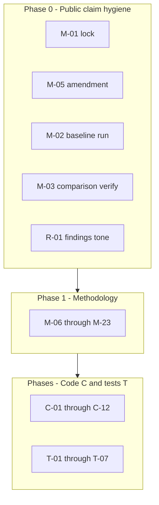

# Full punch-list implementation plan (no deferrals)

## Scope and source of truth

- **Punch list:** [prompts/punch-list/current.md](prompts/punch-list/current.md) (92 items).
- **Detailed steps:** [prompts/implementation-plan/current.md](prompts/implementation-plan/current.md) already breaks work into phases (0 = public-claim blockers, 1 = methodology, later phases for code/data/reporting/tests). This plan **does not duplicate** that document; it **sequences and hardens** it so every ID has an explicit deliverable.

**Note:** [config.toml](config.toml) already has `colby-hall` with `role = "target"`. Treat **M-04** as: confirm roster matches AGENTS rules (exactly one target, no forbidden slugs in main survey path) and reconcile punch list text if it was written against an older snapshot.

## Coordinator preface (AGENTS.md)

- **Sacred:** stage boundaries `scrape → extract → analyze → report`; data under `data/` via `AnalysisArtifactPaths`.
- **Validation:** `uv run ruff check .`, `uv run ruff format --check .`, `uv run pytest tests/ -v` after each mergeable chunk; GitNexus `impact` before editing symbols, `detect_changes` before commit (per workspace rules).
- **Conflict resolution:** correctness and data integrity over speed when trade-offs appear.

## Architecture gate (must resolve before coding C-06)

**C-06** asks analyze to stop opening SQLite `Repository` and read only Parquet/JSON. That **changes the stage-boundary contract** documented in [AGENTS.md](AGENTS.md) (“analyze reads artifacts”). Per your rule: **stop and get explicit approval** before implementing C-06. Until approved, implement everything else; for C-06 deliver a short **ADR** stating options: (a) keep SQLite reads with documented exception, (b) export scrape-time slices to Parquet during extract and switch analyze, (c) read-only SQLite snapshot path.

## Phase execution (map every punch ID)

### Phase 0 — Blockers (M-01, M-02, M-03, M-04, M-05, R-01, R-02, R-03, R-04)

Follow **implementation-plan Phase 0** exactly:

| ID | Deliverable |
|----|----------------|
| M-01 | Real `data/preregistration/preregistration_lock.json` via `uv run forensics lock-preregistration` after M-05 decision |
| M-05 | Append exploratory amendment to `data/preregistration/amendment_phase15.md` (or chosen path from plan) |
| M-02 | Populated `data/ai_baseline/...` + non-null `ai_baseline_similarity` in drift JSON after `forensics baseline` + drift re-run |
| M-03 / M-04 | Non-empty `data/analysis/comparison_report.json`; verify target in config |
| R-01–R-04, R-06 | Edit generated narrative / Quarto inputs as described in plan (exploratory framing, empty comparison caveat, author counts, J5 disclosure, downgrade pooled-byline primacy) |

**R-05, R-07–R-09:** same Phase 0.6 narrative pass in implementation-plan (table caveats, marker version line, per-row criteria if templated, cross-corpus section accuracy).

### Phase 1 — Methodology (M-06–M-23)

Execute **implementation-plan Phase 1** sections 1.1–1.x** so each M-item closes:

- **M-06, M-20, M-21, N-01, N-02, N-04:** marker / formula pattern audit, version bump in [src/forensics/features/lexical.py](src/forensics/features/lexical.py) and [src/forensics/features/content.py](src/forensics/features/content.py), schema propagation for N-04 (column or metadata in Parquet writer).
- **M-07, R-05, R-06:** staff-byline disaggregation attempt + reporting separation (SQL + narrative).
- **M-08:** external controls — **no deferral**: complete **research + config stub** in one PR: documented candidates, `[[authors]]` placeholders commented with `enabled = false` or separate `config.external_controls.example.toml`, plus RUNBOOK steps. Full scrape only after human picks outlet (legal/ToS).
- **M-09:** cross-author BH in [src/forensics/analysis/statistics.py](src/forensics/analysis/statistics.py) behind `AnalysisConfig` flag (default off until preregistered), models extended per plan.
- **M-10:** rename / add `effect_proxy` for PELT in models + consumers ([src/forensics/models/analysis.py](src/forensics/models/analysis.py), [src/forensics/analysis/changepoint.py](src/forensics/analysis/changepoint.py), evidence filters).
- **M-11:** per-author BOCPD hazard as in plan ([changepoint.py](src/forensics/analysis/changepoint.py), [settings.py](src/forensics/config/settings.py)).
- **M-12, M-13:** time-series diagnostic + narrative fix (artifact or notebook snippet checked into `docs/` or `data/analysis/` as appropriate — **no deferral** means documented conclusion in repo).
- **M-14:** re-enable or per-author section sensitivity where J5 BORDERLINE; wire config + sensitivity runner for flagged slugs.
- **M-15:** raise minimum n for tests (configurable threshold, default ≥5 or document Welch at n=2 disabled).
- **M-16:** implement one chosen approach (block bootstrap or HAC) behind flag + tests.
- **M-17:** **no deferral** — add optional `ArticleLabel` / JSONL contract under `data/labels/README.md`, empty seed file, and report section “precision/recall unknown without labels”; if you later add rows, pipeline reads them.
- **M-18, M-19:** convergence scoring adjustments or caps per plan ([convergence.py](src/forensics/analysis/convergence.py)); document in amendment if thresholds change again.
- **M-22:** **no deferral** — add `docs/adr/` entry “Observational limits” + report boilerplate; optional DiD scaffolding (config dates + stub function) if plan specifies.
- **M-23:** synthetic null calibration script + output under `data/provenance/` referenced from RUNBOOK.

### Phase B — Code quality C-01–C-12

| ID | Primary files |
|----|----------------|
| C-01 | [src/forensics/utils/datetime.py](src/forensics/utils/datetime.py), [changepoint.py](src/forensics/analysis/changepoint.py) — stable sort key (`timestamp`, `article_id`) |
| C-02 | [changepoint.py](src/forensics/analysis/changepoint.py) — single imputation site |
| C-03, C-04 | [drift.py](src/forensics/analysis/drift.py) — use `_cosine_similarity` or shared guard |
| C-05 | [dedup.py](src/forensics/scraper/dedup.py) — transactional SQLite or two-phase with integrity flag |
| C-06 | **ADR + approval** (see gate above) |
| C-07 | [statistics.py](src/forensics/analysis/statistics.py) — dedupe `_cohens_d_meta` |
| C-08 | [convergence.py](src/forensics/analysis/convergence.py) — narrow legacy catch |
| C-09 | [orchestrator.py](src/forensics/analysis/orchestrator.py) — explicit `get_context("spawn")` |
| C-10 | [content.py](src/forensics/features/content.py) — require `analysis` or log error |
| C-11 | Document limitation or shared cache file (pick one in implementation) |
| C-12 | Peer-window index / deque optimization in [content.py](src/forensics/features/content.py) |

### Phase D — Data / corpus D-01–D-10

- **D-01, D-04:** [hashing.py](src/forensics/utils/hashing.py) normalization + migration note + optional one-shot `forensics` maintenance command to recompute simhashes.
- **D-02:** normalize all datetimes at ingestion in [datetime.py](src/forensics/utils/datetime.py) + repository read path.
- **D-03:** scrape coverage summary artifact from errors JSONL + link from report template.
- **D-05:** manifest dedupe on write in [parquet.py](src/forensics/storage/parquet.py).
- **D-06:** export manifest with `articles.db` mtime/hash in [export.py](src/forensics/storage/export.py) + warning in extract/report.
- **D-07:** [url.py](src/forensics/utils/url.py) — exclude year-only path segments.
- **D-08:** [repository.py](src/forensics/storage/repository.py) — try/except `JSONDecodeError` → skip row + log.
- **D-09:** staleness policy doc in RUNBOOK + optional `last_scraped_at` in run_metadata.
- **D-10:** optional min word count at analysis or winsorize marker rate.

### Phase I — Config / infra I-01–I-06

- **I-01, P-02–P-04:** extend [fingerprint.py](src/forensics/config/fingerprint.py) to hash scraper subset, LDA seed, bootstrap seed, UMAP seed from config (add fields to `AnalysisConfig` / feature config as needed).
- **I-02:** adaptive `convergence_window_days` from posting rate ([settings.py](src/forensics/config/settings.py) + [convergence.py](src/forensics/analysis/convergence.py)).
- **I-03:** sensitivity CLI or config array for `baseline_embedding_count`.
- **I-04:** derive dim from embedding model settings in [drift.py](src/forensics/analysis/drift.py).
- **I-05, I-06:** preflight disk check helper + artifact completeness marker for parallel runs.

### Phase F — Provenance P-01–P-05

- **P-01:** report stage refuses mixed `config_hash` across authors ([reporting/](src/forensics/reporting/)).
- **P-05:** full manifest scan in [parquet.py](src/forensics/storage/parquet.py).

### Phase G — Observability L-01–L-06

- **L-01:** JSON artifact for per-window convergence components from [convergence.py](src/forensics/analysis/convergence.py).
- **L-02, L-03:** WARN in [orchestrator](src/forensics/analysis/orchestrator.py) / [drift.py](src/forensics/analysis/drift.py).
- **L-04:** crawler summary JSON next to scrape_errors.
- **L-05:** imputation stats JSON from [changepoint.py](src/forensics/analysis/changepoint.py).
- **L-06:** stderr/ Rich warning in [preregistration.py](src/forensics/preregistration.py) when missing.

### Phase H — Tests T-01–T-07

- **T-01:** extend [tests/unit/test_comparison_target_controls.py](tests/unit/test_comparison_target_controls.py) (or integration) — non-empty targets.
- **T-02:** deterministic same-day fixture test.
- **T-03:** curated pre-2020 text fixtures + Hypothesis where applicable.
- **T-04:** [tests/unit/test_config_hash.py](tests/unit/test_config_hash.py) expansions.
- **T-05:** CI job matrix or `pytest --cov` per package path for new analysis modules.
- **T-06, T-07:** parser fuzz + dedup interrupted-state test per punch list paths.

### Phase I-misc — N-03–N-06

- **N-03:** skip UMAP when insufficient centroids in [drift.py](src/forensics/analysis/drift.py).
- **N-05:** move import to module top in [models/analysis.py](src/forensics/models/analysis.py).
- **N-06:** rename run_metadata field to `last_processed_author` or emit `authors_in_run: list[str]`.

## Definition of done (whole punch list)

1. Every **M/C/D/I/R/P/L/T/N** ID has either a merged code change, a checked-in **operational artifact** (lock, amendment, calibration output), or a **documented human gate** with the blocking artifact named (only for legally blocked external scrape).
2. [prompts/punch-list/current.md](prompts/punch-list/current.md) (or CHANGELOG) updated with a **closure table** mapping ID → PR / commit / doc section (optional single “remediation index” doc if you want prompts immutable).
3. `HANDOFF.md` completion block per AGENTS definition of done (user-requested multi-step work).

## Risk classification (representative)

- **HIGH:** C-06 boundary change; M-09 cross-author multiplicity; P-01 report hard-fail; fingerprint expansion (invalidates old artifacts — document migration).
- **MEDIUM:** M-16 bootstrap complexity; D-01 simhash migration; convergence threshold edits.
- **LOW:** N-items, logging-only L-items.

## Parallelization

After Phase 0 narrative + lock path is decided, parallel tracks: (Track A) methodology/stats/convergence, (Track B) scraper/dedup/hash/datetime, (Track C) reporting/provenance/fingerprint, (Track D) tests mirroring each feature. Merge order: infrastructure fingerprints before full re-run claims.
