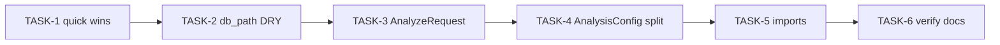

# Refactoring Run 11 — Full implementation plan

**Source:** [Apr 27, 2026: mediaite-ghostink Refactoring Analysis Report](https://www.notion.so/abstractdata/Apr-27-2026-mediaite-ghostink-Refactoring-Analysis-Report-34f7d7f5629881449002e128b2578fd5) (Run 11: 9 issues, 28 occurrences; 0 Critical, 2 High, 4 Medium, 3 Low).

**Governance:** Preserve stage boundaries (`scrape → extract → analyze → report`). Use [`ForensicsSettings.db_path`](src/forensics/config/settings.py) (computed field ~389–393) as the canonical default SQLite path instead of hand-built `root / "data" / "articles.db"`. For `AnalysisConfig` split, **correctness and data integrity** trump convenience: preregistration / `config_hash` must remain stable unless an intentional version bump is documented.

**Pre-flight (every implementation phase):** Run GitNexus `impact` upstream on symbols you edit; after staging, `detect_changes` on staged scope. Validation: `uv run ruff check .`, `uv run ruff format --check .`, `uv run pytest tests/ -v`.

---

## Annotated tasks (Plan Mode protocol)

| Task ID | Title | Exec | Model | Model rationale | Est. tokens |
|---------|-------|------|-------|-----------------|-------------|
| **TASK-1** | Quick wins: dead TODOs, mkdir, DRY-002, DRY-003 | sequential | claude-sonnet-4-6 | Touches hypothesis path + module layout; needs careful test read | ~50K |
| **TASK-2** | RF-DRY-001: unify default `articles.db` via `settings.db_path` | sequential[after: TASK-1] | claude-sonnet-4-6 | Many call sites + CLI overrides; thread settings/db_path correctly | ~50K |
| **TASK-3** | RF-COMPLEX-001/002: `AnalyzeRequest` + slim Typer `analyze` | sequential[after: TASK-2] | claude-sonnet-4-6 | CLI contract + `forensics all` integration | ~200K |
| **TASK-4** | RF-SMELL-001: nested sub-configs inside `AnalysisConfig` | sequential[after: TASK-3] | claude-sonnet-4-6 | High risk: TOML + hash; needs golden fixture | ~200K |
| **TASK-5** | RF-SMELL-002: canonical `AnalysisArtifactPaths` imports | sequential[after: TASK-4] | claude-haiku-4-5 | Mechanical renames across tests/src | ~10K |
| **TASK-6** | Verify + HANDOFF/RUNBOOK/ADR touch-up | sequential[after: TASK-5] | claude-sonnet-4-6 | Synthesis + doc accuracy | ~50K |

*If a listed model is unavailable in Cursor, substitute **cursor-auto** or **gpt-5-3-codex** per your selector.*

---

## TASK-1 — Quick wins (RF-DEAD-001, RF-DEAD-002, RF-DRY-002, RF-DRY-003)

**RF-DEAD-001** — [`src/forensics/models/report.py`](src/forensics/models/report.py): Module docstring and lines 6–11, 60–61 still say `TODO(phase-8)` while Phase 8 is done. Replace with accurate documentation of what *is* implemented vs deferred (or point to a single GitHub/Notion tracking item if manifest work is still open). Remove misleading “stub for later phases” framing if the type is in active use.

**RF-DEAD-002** — [`src/forensics/cli/analyze.py`](src/forensics/cli/analyze.py): Remove redundant `analysis_dir.mkdir(parents=True, exist_ok=True)` at the report’s ~783 and ~848 locations (confirm write helpers already create parents).

**RF-DRY-002** — [`src/forensics/analysis/orchestrator/per_author.py`](src/forensics/analysis/orchestrator/per_author.py): In `_run_preregistered_split_tests`, replace the inline numpy median / `nan_to_num` block (lines ~164–169) with `_clean_feature_series(df_author, feature)` so behavior matches `_run_hypothesis_tests_for_changepoints` cleaning. Preserve the early `finite.size == 0: continue` semantics if `_clean_feature_series` does not skip empty series the same way (align or add a one-line guard).

**RF-DRY-003** — Add `utc_archive_stamp() -> str` in [`src/forensics/utils/`](src/forensics/utils/) (new small module, e.g. `datetime_stamps.py`, or extend an existing util if one already centralizes time — avoid conflicting with stdlib `datetime`). Replace three call sites: [`src/forensics/features/pipeline.py`](src/forensics/features/pipeline.py) (lines ~122, ~136), [`src/forensics/calibration/runner.py`](src/forensics/calibration/runner.py) (~359).

---

## TASK-2 — RF-DRY-001: default `db_path` construction (Medium)

**Inventory (verified grep):** Literal default construction appears in:

- [`src/forensics/pipeline.py`](src/forensics/pipeline.py) (~85)
- [`src/forensics/cli/analyze.py`](src/forensics/cli/analyze.py) (~374, ~733, ~798)
- [`src/forensics/cli/__init__.py`](src/forensics/cli/__init__.py) (~407, ~573)
- [`src/forensics/cli/extract.py`](src/forensics/cli/extract.py) (~52)
- [`src/forensics/cli/calibrate.py`](src/forensics/cli/calibrate.py) (~70)
- [`src/forensics/cli/survey.py`](src/forensics/cli/survey.py) (~193)
- [`src/forensics/cli/migrate.py`](src/forensics/cli/migrate.py) (~64, ~141)
- [`src/forensics/reporting/__init__.py`](src/forensics/reporting/__init__.py) (~109)
- [`src/forensics/survey/orchestrator.py`](src/forensics/survey/orchestrator.py) default branch (~475)
- [`src/forensics/calibration/runner.py`](src/forensics/calibration/runner.py) default branch (~356)
- [`src/forensics/tui/screens/discovery.py`](src/forensics/tui/screens/discovery.py) (~78) — *extends Notion’s table*

**Pattern:** Where `ForensicsSettings` is already loaded, use **`settings.db_path`**. Where only `root` exists, pass **`db_path: Path`** from the caller or build `AnalyzeContext` / pipeline entry with settings first. Keep **`--db` / optional overrides** explicit: `db_path = override or settings.db_path`.

**Tests:** Add or extend a test that default path equals `ForensicsSettings().db_path` for a controlled project root if fixtures permit; CLI override tests unchanged.

---

## TASK-3 — RF-COMPLEX-001 + RF-COMPLEX-002 (High + Medium)

**Current state:** [`run_analyze`](src/forensics/cli/analyze.py) (~344–366) takes many keyword-only flags; [`AnalyzeContext`](src/forensics/cli/analyze.py) (~45–79) already groups `db_path`, `settings`, `paths`, author, workers, compare, exploratory, embedding flag — but not the full CLI surface.

**Deliverables:**

1. Introduce a frozen dataclass or Pydantic model **`AnalyzeRequest`** (name as in report) holding all parameters currently passed through `run_analyze` (including `typer_context`, mode flags, `skip_generation`, `verify_corpus`, `baseline_model`, `articles_per_cell`, `parallel_authors`, etc.).
2. Refactor **`run_analyze(request: AnalyzeRequest) -> None`** (or equivalent single-arg + explicit optional progress hook if needed). Update [`forensics all`](src/forensics/cli/__init__.py) and any direct callers.
3. **RF-COMPLEX-002:** Extract Typer `Option(...)` / `Annotated` definitions into a dedicated module (e.g. `src/forensics/cli/analyze_options.py`) or reusable aliases so the main `analyze` callback in [`src/forensics/cli/analyze.py`](src/forensics/cli/analyze.py) shrinks below the ~100-line maintainability target for the *glue* layer (help strings may stay co-located or move with options).

**Risk:** Typer help text and defaults must stay identical unless intentionally versioned.

---

## TASK-4 — RF-SMELL-001: `AnalysisConfig` decomposition (High)

**Current state:** [`AnalysisConfig`](src/forensics/config/settings.py) is a large flat `BaseModel` (~101–267) with many `include_in_config_hash` fields.

**Target sub-models (per report):** `PeltConfig`, `BocpdConfig`, `ConvergenceConfig`, `ContentLdaConfig`, `HypothesisConfig` (field lists as in Notion; fold `changepoint_methods` / `min_articles_for_period` / PELT fields into the most coherent group and document).

**Backward-compatible TOML:** Prefer **flat `[analysis]` keys unchanged** for operators: implement nested composition on `AnalysisConfig` with a **`model_validator(mode="before")`** that maps legacy flat dict keys into nested sub-dicts **or** use Pydantic v2 field aliases so existing `config.toml` loads without migration. Avoid silent hash changes.

**Config hash:** Add a **golden test**: canonical serialized subset of analysis settings used for preregistration / pipeline hash matches pre-refactor output for a fixed fixture `config.toml` (or document a one-time hash bump with ADR if unavoidable). Audit every `json_schema_extra={"include_in_config_hash": True}` survives on the correct leaf fields.

**Call sites:** Grep `settings.analysis.` and `analysis_cfg.` across `src/forensics/` and tests; update to nested access (`settings.analysis.pelt.pelt_penalty`, etc.) or provide **forwarding properties** on `AnalysisConfig` for a transitional period — pick one style and apply consistently to avoid dual APIs.

**Docs:** New or updated ADR under [`docs/adr/`](docs/adr/) describing nested model layout and hash/TOML guarantees; update any `config.toml` examples in docs if nested sections are introduced later.

---

## TASK-5 — RF-SMELL-002: canonical `AnalysisArtifactPaths` import

**Current state:** [`src/forensics/analysis/artifact_paths.py`](src/forensics/analysis/artifact_paths.py) re-exports from [`src/forensics/paths.py`](src/forensics/paths.py). Mixed usage: many files import `forensics.analysis.artifact_paths`, others `forensics.paths`.

**Deliverable:** Standardize **production imports** on **`from forensics.paths import AnalysisArtifactPaths`**. Update tests and scripts similarly. Either remove the re-export after migration or keep `artifact_paths.py` as a thin deprecated shim with a comment pointing to `forensics.paths` (align with existing deprecation note in [`src/forensics/analysis/utils.py`](src/forensics/analysis/utils.py) ~19–20).

---

## TASK-6 — Verification and session boundaries

- Run full pytest + ruff.
- **`npx gitnexus analyze`** after large graph edits (per AGENTS).
- Append completion block to [`HANDOFF.md`](HANDOFF.md); update [`docs/RUNBOOK.md`](docs/RUNBOOK.md) if CLI or config operator steps change.

---

## Dependency graph

---

## Out of scope

- Editing the Notion report itself or Cursor plan markdown files (per your repo preference).
- Changing stage contracts or embedding model pin without explicit approval.
