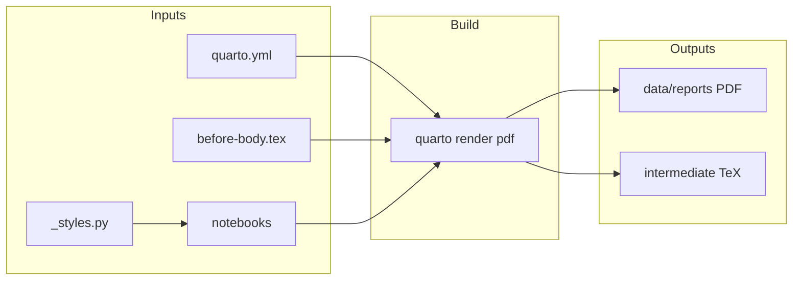

# Report visual polish (Quarto PDF production pass)

Source of truth: [prompts/report-visual-polish/current.md](prompts/report-visual-polish/current.md) (aligns with [prompts/report-visual-polish/v0.1.0.md](prompts/report-visual-polish/v0.1.0.md)). Scope is **report artifacts only**: [quarto.yml](quarto.yml), new LaTeX at repo root, [notebooks/](notebooks/), [HANDOFF.md](HANDOFF.md), [docs/RUNBOOK.md](docs/RUNBOOK.md). Per prompt **out of scope**: `src/forensics/`, `config.toml`, chapter order in `quarto.yml`, narrative prose changes, HTML-only polish (Plotly may remain only if you implement a dual render path; simplest compliance is **matplotlib everywhere** in bound chapters so one notebook serves both HTML and PDF).

## Current repo snapshot (relevant gaps)

- [quarto.yml](quarto.yml) `format.pdf` is minimal (`toc`, `number-sections`, `documentclass: report`) — far from the required XeLaTeX/KOMA + `include-in-header` block.
- Plotly appears in book chapters: [notebooks/01_scraping.ipynb](notebooks/01_scraping.ipynb), [notebooks/03_exploration.ipynb](notebooks/03_exploration.ipynb), [notebooks/05_change_point_detection.ipynb](notebooks/05_change_point_detection.ipynb) (heatmap), [notebooks/06_embedding_drift.ipynb](notebooks/06_embedding_drift.ipynb), [notebooks/08_control_comparison.ipynb](notebooks/08_control_comparison.ipynb), [notebooks/09_full_report.ipynb](notebooks/09_full_report.ipynb). [notebooks/10_survey_dashboard.ipynb](notebooks/10_survey_dashboard.ipynb) / [notebooks/11_calibration.ipynb](notebooks/11_calibration.ipynb) are **not** in `quarto.yml` book chapters — only touch them if you want zero Plotly in any `quarto render` the team runs; the prompt’s PDF path is the **bound book**.
- No `matplotlib` / `tabulate` / `great_tables` / `pypdf` in [pyproject.toml](pyproject.toml) (Plotly is explicit). Pandas `to_markdown()` needs **`tabulate`**. Optional **`great_tables`** per prompt for styled tables.
- Greek/math fixes are primarily **markdown cell edits** (e.g. `$\alpha \leq 0.05$`) plus PDF engine unicode support.

## Fix 1 — PDF engine, fonts, TOC/LoF/LoT, headers (edit `quarto.yml`)

- Replace `format.pdf` with the block from the prompt (lines 41–84 of `current.md`): `pdf-engine: xelatex`, `documentclass: scrartcl`, `mainfont` / `sansfont` / `monofont`, `toc-depth`, `lof`, `lot`, `geometry`, `include-in-header` (unicode-math, microtype, seqsplit, xcolor palette, scrlayer-scrpage, lastpage).
- **Path resolution**: `include-before-body: before-body.tex` is relative to project root (same as `quarto.yml`); add [before-body.tex](before-body.tex) at repo root (fix 2).
- **Risk (correctness / maintainability)**: Quarto `project: book` + `scrartcl` is allowed by Quarto’s PDF docs, but KOMA must be installed (`scrartcl.cls` / `koma-script`). If the first `quarto render --to pdf` fails, install KOMA via your TeX distro; document the fix in RUNBOOK.
- **Footer date**: the prompt hard-codes `2026-04-24` in `\cfoot`. Prefer `\today` or Quarto’s `date` metadata so the deliverable does not go stale — note the deviation in HANDOFF.

## Fix 2 — Cover page (`before-body.tex` + wire-up)

- Add `before-body.tex` exactly as specified in the prompt (title page, metadata tabular, CONFIDENTIAL banner, colors `adnavy` / `adred` defined in header already).
- **Metadata realism**: Run ID and corpus hash in the prompt are **examples**. For a forensic deliverable, either (a) keep literals for the first pass and refresh when re-issuing the report, or (b) **without touching `src/`**, replace those two lines manually from `data/analysis/run_metadata.json` / custody artifacts before each client drop. If you later want automation, that is a separate, explicit change to the report stage in Python (out of this prompt’s minimal surface).

## Fix 3 — Polars tables → Markdown / great_tables + `#| tbl-*`

- Sweep **all** notebooks under [notebooks/](notebooks/) that are book chapters (especially those named in the prompt: `02_corpus_audit`, `04_feature_analysis`, `05_change_point_detection`, `07_statistical_evidence`, `09_full_report`, plus any other chapter where the last cell expression is a Polars `DataFrame` / `LazyFrame` / `print(df)`).
- Replace trailing `df` / `display(df)` patterns with:
  - `from IPython.display import Markdown`
  - `Markdown(df.to_pandas().to_markdown(index=False, floatfmt=",.3f"))` (add **`tabulate`** dependency).
- For richer tables, use **`great_tables`** as in the prompt; add dependency if used.
- Each table cell: Quarto options `#| label: tbl-...` and `#| tbl-cap: "..."`.
- **Verify**: after render, search emitted LaTeX for schema tokens (the prompt suggests `grep` on `*.tex`; Quarto may place `.tex` beside the PDF or under a Quarto cache path — adjust grep to the actual path your Quarto version writes, documented in HANDOFF).

## Fix 4 — Matplotlib unification + [notebooks/_styles.py](notebooks/_styles.py)

- Add `_styles.py` at repo root of notebooks (import path: `from _styles import apply_report_style` may require `sys.path` tweak or package layout — prefer **relative import via `%run` / `import importlib.util`** or add notebooks to `PYTHONPATH` in a first cell; simplest: place helpers under `notebooks/_styles.py` and in the first code cell `from pathlib import Path; import sys; sys.path.insert(0, str(Path("notebooks").resolve()))` **or** document running from repo root with `sys.path.insert(0, ".")` — pick one pattern and use it consistently).
- Call `apply_report_style()` once per notebook before plotting.
- **Per-chart** (prompt fix 4):
  - **05**: Replace Plotly heatmap with `matplotlib` (`imshow` / `pcolormesh` / `Axes.imshow`), horizontal y tick labels, larger left margin, x labels 60°.
  - **06**: Replace `go.Figure` line + histogram with matplotlib; histogram → **4×4 small multiples**; line chart → single-line y-label + explicit title.
  - **07**: Bar chart → 90° labels or split top/bottom 10.
  - **08**: Prompt calls dual-line “reference style” but current code is Plotly — **rebuild in matplotlib** to satisfy “no Plotly in PDF” and grep-based verification.
  - **01**, **03**, **09**: Convert Plotly charts to matplotlib using the same palette.
- **Dual HTML/PDF**: Prompt allows Plotly on HTML only. Implementing that requires format-conditional cells (params or Quarto profiles). **Default plan**: use matplotlib for both formats to avoid conditional execution complexity unless you explicitly want dual engines.

## Fix 5 — Figure/table numbering and `@fig-` / `@tbl-` references

- For every plotting cell: `#| label: fig-...`, `#| fig-cap: "..."`.
- Update markdown prose where it says “above/below” to `@fig-...` / `@tbl-...` where it adds value (acceptance: at least one resolved `@fig-` reference).
- Confirm LoF/LoT populate (prompt: ≥8 figures, ≥6 tables — approximate; depends on corpus).

## Fix 6 — Paths and inline code (LaTeX)

- Add `\providecommand{\codebrk}[1]{\texttt{\seqsplit{#1}}}` via header or a small `macros.tex` included from `include-in-header`.
- Add `tcolorbox` + `\codebox` definition from prompt; wire **Quarto** `monofont` / inline code styling as needed (may need Quarto HTML vs PDF differences — focus PDF).
- Edit notebook **markdown** where long backtick paths or module names overflow; use `\codebrk{...}` via raw LaTeX small blocks where necessary (` ```{=latex} ` spans).

## Fix 7 — Page breaks / whitespace

- After switch to `scrartcl`, re-render and check pages called out in the prompt; if large vertical gaps remain, add `\raggedbottom` to `include-in-header` as suggested.

## Dependencies and tooling

- [pyproject.toml](pyproject.toml): add explicit **`matplotlib`**, **`tabulate`**, optional **`great_tables`**, optional **`pypdf`** (dev or main — used only for verification snippet; dev keeps install lean).
- RUNBOOK: **MacTeX / TeX Live** prerequisites — `xelatex`, **KOMA-Script** (`koma-script`), `lastpage`, `microtype`, `unicode-math`, `fontspec` (via XeLaTeX), **TeX Gyre Pagella** / **Inter** / **JetBrains Mono** (or fallbacks per prompt: Source Serif 4 / Source Sans 3, then Charter / IBM Plex Sans). Document `tlmgr` / `brew` packages that were needed.
- Re-freeze notebooks: after code changes, run `quarto render` so `execute: freeze` updates stored outputs if your workflow relies on freeze (see [quarto.yml](quarto.yml) `execute: freeze: auto`).

## Verification (from prompt; use `uv run` for Python)

- `uv sync` then `quarto render --to pdf` from repo root.
- Page count: `uv run python -c "from pypdf import PdfReader; ..."` (once `pypdf` added).
- Grep checks for Polars schema leakage and `plotly` in emitted TeX — **discover actual `.tex` path** first build.
- `quarto check` optional.
- If LaTeX fails repeatedly on the same error, append a Sign to [docs/GUARDRAILS.md](docs/GUARDRAILS.md) per AGENTS.

## Documentation deliverables

- [HANDOFF.md](HANDOFF.md): new completion block — files touched, font choices / fallbacks, page count before vs after, verification command summaries, open issues.
- [docs/RUNBOOK.md](docs/RUNBOOK.md): new **Reports** subsection — XeLaTeX, fonts, KOMA, `quarto render --to pdf`, troubleshooting.

## GitNexus / impact

- **No** `src/forensics/` edits planned → GitNexus **impact** not required for pipeline symbols. If anything under `src/` is touched later for metadata injection, run `gitnexus_impact` before editing.


