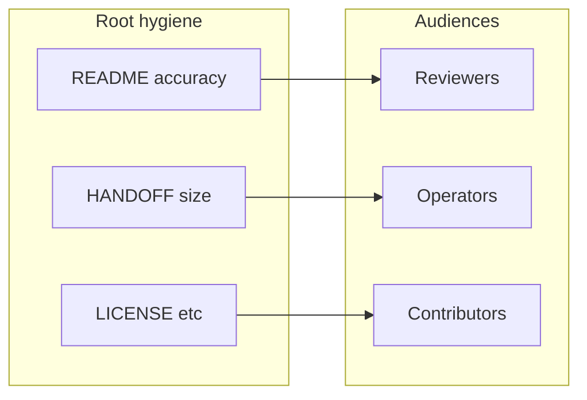

# Root cleanup, README, and production readiness

## Context

This repo is a **Python forensic pipeline** (not a deployed web service). “Production-ready” here means: **clean clone**, **accurate first-run docs**, **clear licensing and contribution paths**, and **no accidental shipping of agent logs or local caches**.

Current root issues (from workspace inspection):

| Item | Issue |
|------|--------|
| [`HANDOFF.md`](HANDOFF.md) | **Tracked and very large** (~446KB completion log). Clones and GitHub file views pay this cost; it is operator/agent-oriented, not client-facing. |
| [`README.md`](README.md) | **Reports (Quarto)** section still says [`quarto.yml`](README.md) and `quarto.yml` `output-dir`; canonical config is **[`_quarto.yml`](_quarto.yml)** (see [`tests/test_report.py`](tests/test_report.py), [`AGENTS.md`](AGENTS.md)). |
| [`docs/ARCHITECTURE.md`](docs/ARCHITECTURE.md) | Same stale **`quarto.yml`** wording in two places (report stage + data layout). |
| License / governance | **No `LICENSE`**, no **`CONTRIBUTING.md`**, no **`SECURITY.md`**; [`pyproject.toml`](pyproject.toml) has no `license` metadata. |
| [`TASK.md`](TASK.md) | Small internal queue at repo root; fine functionally but adds root surface area. |
| Local artifacts | **`coverage.json`**, **`.coverage`**, **`_freeze/`**, **`.DS_Store`** present on disk; [`.gitignore`](.gitignore) already lists `coverage.json`, `_freeze/`, `.DS_Store` — ensure nothing force-tracked and document “delete if present” in cleanup. |
| [`coverage-tui.toml`](coverage-tui.toml) | Legitimate alternate pytest-cov config ([`docs/RUNBOOK.md`](docs/RUNBOOK.md)); optional move under `docs/` or `tests/` with RUNBOOK path update if you want fewer root files. |

---

## 1. Root cleanup (HIGH impact: HANDOFF)

**Goal:** Keep the **handoff protocol** required by [`AGENTS.md`](AGENTS.md) without shipping an unbounded append-only log in the default branch.

**Recommended approach (minimal contract change):**

1. **One-time archive:** Move the bulk of the existing “Completion Log” from [`HANDOFF.md`](HANDOFF.md) into a new file such as [`docs/archive/handoff-history.md`](docs/archive/handoff-history.md) (or `docs/internal/…` if you prefer stricter naming). Preserve git history of prose via a single commit that *moves* content (copy + trim + delete old sections).
2. **Reset [`HANDOFF.md`](HANDOFF.md)** to: protocol + template + **only the last 1–3** completion blocks (or none + pointer to the archive for “full history”).
3. **Optional guardrail:** Add a short note in [`AGENTS.md`](AGENTS.md) or [`docs/RUNBOOK.md`](docs/RUNBOOK.md): when `HANDOFF.md` exceeds ~N KB, archive older blocks to `docs/archive/` in the same PR as the work that caused growth.

**Avoid:** Adding `HANDOFF.md` to `.gitignore` — that would conflict with the mandatory append rule in AGENTS unless you relocate the canonical handoff path everywhere (larger change).

**[`TASK.md`](TASK.md):** Move to [`docs/TASK.md`](docs/TASK.md) (or fold into upcoming `CONTRIBUTING.md`) and replace root with nothing, or a one-line pointer in README under contributor notes — **LOW risk**, update any internal links if present.

**Ephemeral files:** Remove untracked `coverage.json`, `.coverage`, root `_freeze/` if they are regeneration-only (already ignored). Do not commit them.

---

## 2. README: production readability

[`README.md`](README.md) is already deep and accurate in many areas. Targeted edits for **first impression** and **correctness**:

1. **Add a short “At a glance” block** at the top (after badges): 3–5 bullets — what the pipeline produces, who it is for (forensic reviewers / data operators / engineers), and explicit **non-claim** (“statistical signals, not attribution of authorship or legal findings” — aligns with Responsible use).
2. **Fix Quarto references:** Replace `quarto.yml` with **`_quarto.yml`** in the Reports section and repository layout table (and anywhere else in README).
3. **Quick path vs deep path:** A small **“5-minute smoke”** box: `uv sync --extra dev` → spaCy model → `uv run forensics validate` / `preflight` — then link to “Typical workflows” for full runs.
4. **Contributor vs consumer split:** Point agents to [`AGENTS.md`](AGENTS.md); point human contributors to new **`CONTRIBUTING.md`** (see below) so README does not need to duplicate governance.
5. **Optional compression:** If README still feels long for executives, move one full algorithm table block into [`docs/ARCHITECTURE.md`](docs/ARCHITECTURE.md) and replace with a single “see Architecture” link — **optional**, only if you want a shorter landing page.

---

## 3. Docs consistency

- Update [`docs/ARCHITECTURE.md`](docs/ARCHITECTURE.md) lines that still say `quarto.yml` to **`_quarto.yml`** (report subprocess + output-dir bullet).
- Grep the repo for remaining **`quarto.yml`** references in **user-facing** docs (not immutable `prompts/` version files unless you want a separate cleanup pass); fix or annotate “historical name” where intentional.

---

## 4. Standard production / GitHub hygiene

| Deliverable | Purpose |
|-------------|---------|
| **`LICENSE`** | Legal clarity for forks, contractors, and clients. **Requires your org’s choice** (proprietary notice vs SPDX identifier). |
| [`pyproject.toml`](pyproject.toml) | Add matching **`license`** / **`license-files`** (or `classifiers`) once `LICENSE` exists. |
| **`CONTRIBUTING.md`** | PR expectations: `uv run ruff` / `pytest`, link to [`docs/TESTING.md`](docs/TESTING.md), HANDOFF append rule, optional GitButler note from RUNBOOK. |
| **`SECURITY.md`** | Vulnerability reporting contact / disclosure policy (GitHub Security tab). |

---

## 5. Verification (after implementation)

- `uv run pytest tests/test_report.py -q` — confirms `_quarto.yml` expectations still match.
- `uv run ruff check .` (unchanged expectation).
- Spot-check: fresh `git clone` size / `HANDOFF.md` line count drops materially.

---

## Risk note

- **HANDOFF archive + trim:** **MEDIUM** — touches governance narrative; keep AGENTS “append to HANDOFF” requirement satisfied by keeping a lean, canonical root [`HANDOFF.md`](HANDOFF.md).
- **License text:** **HIGH** legal sensitivity — do not invent a license; use Abstract Data’s approved template.
