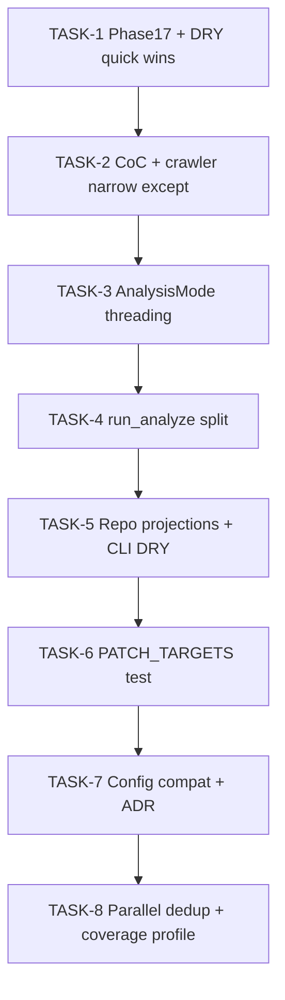

# Run 12 Notion reports — full implementation plan

**Sources:** [Code Review Report](https://www.notion.so/34f7d7f5629881e4bf3cce54120f5e4a), [Refactoring Analysis Report](https://www.notion.so/34f7d7f5629881a0a686f583c23af362), plus local Phase 17 tracker [`.cursor/plans/phase_17_diagnostics_c4e40eae.plan.md`](.cursor/plans/phase_17_diagnostics_c4e40eae.plan.md) (Phase D still `in_progress`).

**AGENTS alignment:** Preserve stage boundaries; keep writes under `data/` for runtime; use `uv run` for validation. **Correctness / data integrity** override convenience: any change touching `compute_analysis_config_hash` / `compute_model_config_hash` paths must keep existing goldens in [`tests/unit/test_config_hash.py`](tests/unit/test_config_hash.py) stable unless an ADR documents an intentional hash bump.

**Repo fact (name drift):** Notion refers to `analysis_config_hash()`; the implementation is [`compute_analysis_config_hash`](src/forensics/utils/provenance.py) (lines 146–148). RF-DRY-001 means “route analysis-config hashing through that helper,” not a different symbol.

---

## Execution annotations (Plan Mode protocol)

| Task ID | Title | Exec mode | Model | Rationale | Est. tokens |
|---------|-------|-----------|-------|-----------|-------------|
| TASK-1 | Phase 17 tail + RF quick wins | parallel (subdirs isolated) | claude-sonnet-4-6 | Small, independent files | ~50K |
| TASK-2 | P1 chain-of-custody + crawler exceptions | sequential after TASK-1 | claude-sonnet-4-6 | Touches CLI + scraper + baseline | ~50K |
| TASK-3 | AnalysisMode + threading | sequential after TASK-2 | claude-sonnet-4-6 | Wide blast radius (11+ files) | ~200K |
| TASK-4 | run_analyze decomposition | sequential after TASK-3 | claude-sonnet-4-6 | Overlaps RF-CPLX-001 / P1-MAINT-002 | ~200K |
| TASK-5 | Repository projections + duplicate logs | sequential after TASK-4 | claude-sonnet-4-6 | Storage + orchestrator | ~50K |
| TASK-6 | Orchestrator monkeypatch guard + tests | sequential after TASK-5 | claude-sonnet-4-6 | Couples to test harness | ~50K |
| TASK-7 | AnalysisConfig hygiene + compat split | sequential after TASK-6 | claude-sonnet-4-6 | Hash / TOML risk | ~200K |
| TASK-8 | Parallel/staleness dedup + coverage profile | sequential after TASK-7 | claude-sonnet-4-6 | Lower priority RF items | ~50K |

Parallel rule: TASK-1 sub-items can split only where they do not edit the same file in the same batch.

---

## TASK-1 — Phase 17 completion + zero-risk DRY (no behavior change)

**Phase 17 (local plan):** Mark Phase D complete per [`.cursor/plans/phase_17_diagnostics_c4e40eae.plan.md`](.cursor/plans/phase_17_diagnostics_c4e40eae.plan.md): add committed [`tests/fixtures/phase17/`](tests/fixtures/phase17/) JSON (or factories), implement [`tests/integration/test_phase17_classification.py`](tests/integration/test_phase17_classification.py), append [docs/RUNBOOK.md](docs/RUNBOOK.md) “Phase 17 diagnostic columns,” append [HANDOFF.md](HANDOFF.md) completion block, run full `uv run pytest tests/ -v`, `ruff check/format`, optional nbconvert execute for [`notebooks/09_full_report.ipynb`](notebooks/09_full_report.ipynb). Add GUARDRAILS Sign only if a concrete recurring footgun is confirmed.

**RF-DRY-001 (quick win):** Replace direct `compute_model_config_hash(config.analysis, length=16, round_trip=True)` with `compute_analysis_config_hash(config)` where `config` is [`ForensicsSettings`](src/forensics/config/settings.py) in [`src/forensics/analysis/orchestrator/staleness.py`](src/forensics/analysis/orchestrator/staleness.py), [`parallel.py`](src/forensics/analysis/orchestrator/parallel.py). Audit [`per_author.py:291`](src/forensics/analysis/orchestrator/per_author.py): if the local `config` is actually `AnalysisConfig`, normalize to `ForensicsSettings` + `compute_analysis_config_hash(settings)` so hashes cannot diverge from other writers. **Do not** change [`survey/orchestrator.py`](src/forensics/survey/orchestrator.py) call (different `length`/round_trip) unless survey artifacts are proven to require the same digest as analysis (likely separate — verify with tests).

**RF-DRY-002:** Extract the duplicated “comparison_report: empty targets” warning from [`runner.py`](src/forensics/analysis/orchestrator/runner.py), [`parallel.py`](src/forensics/analysis/orchestrator/parallel.py), [`comparison.py`](src/forensics/analysis/orchestrator/comparison.py) into one helper (e.g. on `comparison.py`).

**RF-DRY-003 / P3 overlap:** Single module-level `DEFAULT_EXCLUDED_SECTIONS` (or shared constant in a small `config/constants.py`) referenced by both `SurveyConfig` and `FeaturesConfig` in [`src/forensics/config/settings.py`](src/forensics/config/settings.py); keep existing validator that enforces equality.

**RF-CPLX-001 (partial):** In [`src/forensics/cli/analyze.py`](src/forensics/cli/analyze.py) `run_analyze`, delete the unpack-to-locals block; reference `request.<field>` directly (no behavior change). Full extraction of `_verify_corpus_stage` / `_gate_preregistration` / `_dispatch_analysis_stages` is folded into **TASK-4** to avoid double refactors.

---

## TASK-2 — P1-ARCH-001 + P1-SEC-003 (correctness / contract integrity)

**P1-ARCH-001 — Wire [`ChainOfCustodyConfig`](src/forensics/config/settings.py):**
- **CLI default:** Change `verify_corpus` Typer option in [`analyze.py`](src/forensics/cli/analyze.py) to tri-state (`None` = use `settings.chain_of_custody.verify_corpus_hash`) matching Notion snippet; thread into [`AnalyzeRequest`](src/forensics/cli/analyze.py) and `run_analyze` resolution: `if verify_corpus is None: verify_corpus = settings.chain_of_custody.verify_corpus_hash`.
- **`verify_raw_archives`:** Locate archive rewrite path ([`repository.py`](src/forensics/storage/repository.py) `rewrite_raw_paths_after_archive` and callers); gate extra verification/logging when `settings.chain_of_custody.verify_raw_archives` is true (define minimal, testable behavior: e.g. existence check or hash verification already used elsewhere — discover existing helpers before adding I/O).
- **`log_all_generations`:** Wire into baseline generation path (search `baseline/` and CLI baseline commands) so each generation emits structured log when flag is true.

Add/extend tests in [`tests/test_baseline.py`](tests/test_baseline.py) (already imports `ChainOfCustodyConfig`) and CLI tests for `--verify-corpus` default resolution.

**P1-SEC-003:** In [`src/forensics/scraper/crawler.py`](src/forensics/scraper/crawler.py), remove `TypeError` and `KeyError` from `_METADATA_INGEST_RECOVERABLE`. If any call site relied on swallowing those, add **narrow** `except` at that site only. Run scraper/unit tests that cover metadata ingest.

**GitNexus (executor):** Run upstream `impact` on `run_analyze`, `rewrite_raw_paths_after_archive`, and the metadata ingest function before edits; report blast radius.

---

## TASK-3 — RF-SMELL-002 / P1-MAINT-002 direction: `AnalysisMode` parameter object

Introduce a frozen `@dataclass` (e.g. `AnalysisMode` in [`src/forensics/analysis/orchestrator/context.py`](src/forensics/analysis/orchestrator/) or next to `AnalyzeContext`) holding at minimum `exploratory: bool` and `allow_pre_phase16_embeddings: bool`.

- Thread **one** object through the chain called out in the refactoring report: CLI → `AnalyzeRequest` / context → `run_full_analysis` → `_run_full_analysis_per_authors` → workers → drift/embedding loaders. Update all signatures in the ~11 files cited (analyze CLI, [`parallel.py`](src/forensics/analysis/orchestrator/parallel.py), [`per_author.py`](src/forensics/analysis/orchestrator/per_author.py), [`runner.py`](src/forensics/analysis/orchestrator/runner.py), [`sensitivity.py`](src/forensics/analysis/orchestrator/sensitivity.py), [`comparison.py`](src/forensics/analysis/orchestrator/comparison.py), [`drift.py`](src/forensics/analysis/drift.py), etc.).
- Keep **JSON/run_metadata** stable: if payloads expose booleans today, map to/from the dataclass at boundaries rather than changing serialized keys without an ADR.

**Acceptance:** Full pytest + parallel analysis tests; no new `noqa` for signature count.

---

## TASK-4 — RF-CPLX-001 full + P1-MAINT-002 completion

After TASK-3 reduces parameter noise:

1. Extract `_verify_corpus_stage`, `_gate_preregistration`, `_dispatch_analysis_stages` (names illustrative) from `run_analyze` in [`analyze.py`](src/forensics/cli/analyze.py).
2. Remove `# noqa: C901` only when Ruff passes without it (per AGENTS: prefer decomposition over suppressions).
3. Optionally introduce nested frozen dataclasses on `AnalyzeRequest` (`AnalyzeModeFlags`, `BaselineOptions`, …) **if** it does not change Typer UX — preserve backward-compatible CLI flags.

---

## TASK-5 — P2-PERF-005 + remaining DRY

**P2-PERF-005:** Add narrow repository query helpers in [`src/forensics/storage/repository.py`](src/forensics/storage/repository.py) for hot paths (slug lists, counts) using explicit column lists; migrate call sites proven by grep (survey, scrape batching) where full `Article`/`Author` is unnecessary. Keep existing methods for full pipeline stages.

**P3-DRY-007:** Extract shared preamble from `section_profile_cmd` / `section_contrast_cmd` in [`analyze.py`](src/forensics/cli/analyze.py) into `_resolve_analyze_subcommand_context()` (as in code review).

**P3-MAINT-008:** At process-pool worker entry in [`parallel.py`](src/forensics/analysis/orchestrator/parallel.py) / initializer, add explicit assertion or log when confirmatory mode expects `STRICT_DECODE_CTX` set (document invariant in module docstring).

---

## TASK-6 — P2-TEST-006 + RF-SMELL-003 (monkeypatch contract)

- Document in [`src/forensics/analysis/orchestrator/__init__.py`](src/forensics/analysis/orchestrator/__init__.py) that new re-exported symbols **must** be registered in `_PATCH_TARGETS`.
- Add a unit test that compares `_PATCH_TARGETS` keys to `__all__` / a curated allowlist of public orchestrator entrypoints so drift fails CI.

---

## TASK-7 — RF-SMELL-001 + P2-ARCH-004 (config governance)

**Process (P2-ARCH-004):** Add a short ADR under [`docs/adr/`](docs/adr/) stating: new `AnalysisConfig` leaf fields require ADR approval; optional note on `ContentLdaConfig` placement.

**Technical (RF-SMELL-001) — staged to protect hashes:**

1. Move `_lift_flat_analysis_dict` / `_FLAT_TO_GROUP` / related helpers from [`src/forensics/config/analysis_settings.py`](src/forensics/config/analysis_settings.py) into [`src/forensics/config/compat_analysis.py`](src/forensics/config/compat_analysis.py) (new), **re-export** from `analysis_settings` so imports stay stable unless you prefer updating all imports in one commit.
2. Evaluate `HashableField` / custom annotation **only** if it does not change `model_dump` output used by `compute_model_config_hash`; if risky, substitute “documented helper + ruff rule / review checklist” in the same ADR and still satisfy “no deferral” via governance + compat module split (delivers maintainability without breaking provenance).

Optional split of `ConvergenceConfig` only if golden [`tests/unit/test_config_hash.py`](tests/unit/test_config_hash.py) unchanged or ADR bump updates goldens intentionally.

---

## TASK-8 — RF-CPLX-002 + RF-ARCH-001 + P3-QUAL-009

- **RF-CPLX-002 / RF-ARCH-001:** Factor shared serial/parallel gating in [`parallel.py`](src/forensics/analysis/orchestrator/parallel.py); deduplicate `_per_author_worker` vs `_isolated_author_worker` Repository → `_run_per_author_analysis` → `_write_per_author_json_artifacts` sequence into one internal function. **Risk:** HIGH for parallel promotion — run integration tests for parallel analyze and keep all-or-nothing promotion semantics unchanged.

- **P3-QUAL-009:** Add a secondary coverage config (e.g. `pyproject` `[tool.coverage.run]` alternate via `coverage run --rcfile=...` or documented `uv run` incantation in RUNBOOK) that **includes** `tui/` when the extra is installed; keep CI default fast.

---

## Verification matrix (no deferral — all run before merge)

| Gate | Command / check |
|------|------------------|
| Lint/format | `uv run ruff check .`, `uv run ruff format --check .` |
| Tests | `uv run pytest tests/ -v` |
| Config hash stability | `uv run pytest tests/unit/test_config_hash.py -v` |
| Parallel analyze | Existing integration tests touching [`parallel.py`](src/forensics/analysis/orchestrator/parallel.py) |
| GitNexus | `impact` upstream on each edited public symbol; `detect_changes` before commit |

---

## Mermaid — dependency order

---

## Explicit non-goals (not in Notion body)

- No new dependencies unless a task proves impossible without them (then `uv add` with user approval per AGENTS).
- No client-facing Quarto narrative tone changes unless a task touches those files anyway.
