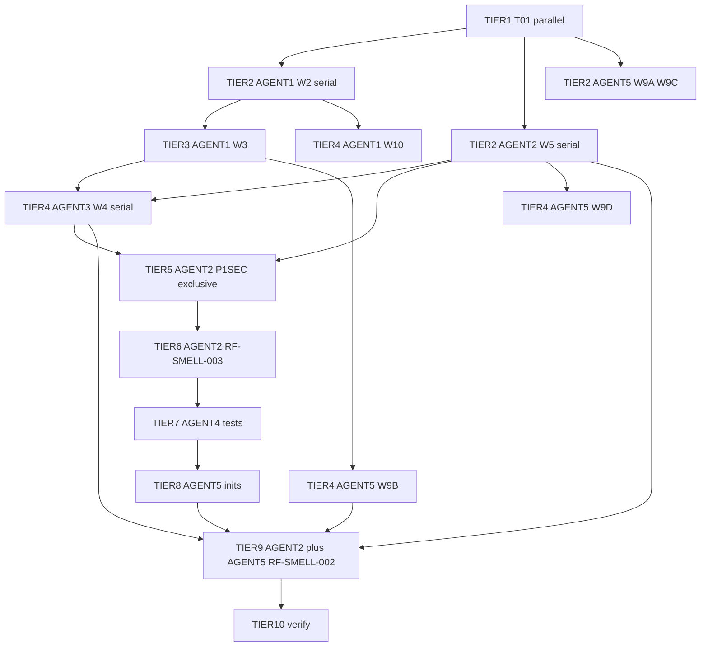

# Run 2 implementation plan (Notion MCP source)

**Sources (fetched with Notion MCP `notion-fetch`):**

- [Code Review Report (Run 2)](https://www.notion.so/34a7d7f5629881f8bffdedc1bb0c6998)
- [Refactoring Analysis Report (Run 2)](https://www.notion.so/34a7d7f56298818989c4c3f2498907cf)

**Note on ID collision:** Run 2 code review reuses labels like `P2-PERF-001` for **per-article LDA fitting** in [`src/forensics/features/content.py`](src/forensics/features/content.py) (not embedding batch I/O). This plan follows **Run 2 Notion definitions** only.

## Agent numbers (use on every task line)

| Tag | Owns (primary paths) | Notes |
|-----|----------------------|--------|
| **`[AGENT 1]`** | [`src/forensics/scraper/`](src/forensics/scraper/), [`src/forensics/cli/scrape.py`](src/forensics/cli/scrape.py) | Never run **two** sessions on `fetcher.py` at once. |
| **`[AGENT 2]`** | [`src/forensics/analysis/`](src/forensics/analysis/), [`src/forensics/storage/duckdb_queries.py`](src/forensics/storage/duckdb_queries.py) | Drift / NPZ read paths for security work stay with this lane. |
| **`[AGENT 3]`** | [`src/forensics/features/`](src/forensics/features/) | `pipeline.py` + `content.py` — one owner; sub-steps are **`[SERIAL]`** inside the lane. |
| **`[AGENT 4]`** | [`tests/`](tests/) | Two **`[AGENT 4]`** chats in **parallel** only if they edit **different** test files. |
| **`[AGENT 5]`** | [`src/forensics/pipeline.py`](src/forensics/pipeline.py), [`src/forensics/config/`](src/forensics/config/), [`src/forensics/cli/`](src/forensics/cli/) (except `scrape.py`), [`pyproject.toml`](pyproject.toml), [`docs/`](docs/) | Ruff/C901, `PipelineContext`, run metadata. |

### Bracket prefix legend

- **`[AGENT N]`** — Required first tag: who implements this row.
- **`[PARALLEL-WITH: AGENT 2, AGENT 3, …]`** — Optional on Wave 1: these **other** agent numbers are safe to run **at the same time** in separate sessions (disjoint files). Wave 1 rows with different `N` are parallel by default even without this tag.
- **`[WAIT-AGENT N | AFTER: AGENT A, AGENT B, …]`** — **Agent N is blocked** on this row until **Agents A, B, …** have merged the work named after the colon (or until you substitute `W2 MERGED`, `W6 MERGED`, etc.).
- **`[WAIT | AFTER: …]`** — Merge-order only (often same agent as prior wave, e.g. “after W2 merged”).
- **`[SERIAL]`** — Same `[AGENT N]`: do the listed sub-items **one after another**, not parallel sessions.

**Hard serial rules (do not parallel these):**

1. **Scraper critical path:** `RF-DRY-001` → `RF-COMP-001` → then `RF-COMP-003` (enum dispatch) on **Agent-Scraper** sequentially — all hot-edit [`fetcher.py`](src/forensics/scraper/fetcher.py) / [`scrape.py`](src/forensics/cli/scrape.py).
2. **`P1-SEC-001` (np.load / NPZ format):** One agent must own **write path** ([`parquet.py`](src/forensics/storage/parquet.py) `write_author_embedding_batch`) **and** **read path** ([`drift.py`](src/forensics/analysis/drift.py) `_load_embedding_row`) together — **no second agent on those files** until merged.
3. **`RF-SMELL-002` (extend `AnalysisArtifactPaths`):** Touches many signatures across stages — run as **dedicated merge wave** after smaller PRs land, or isolate on a branch that rebases frequently.
4. **`RF-ARCH-001` (`PipelineContext` / audit logging):** Touches multiple CLI entrypoints — **serialize** with other `cli/*.py` edits, or batch entirely on **Agent-Platform** after scraper enum work if scrape CLI imports change.

---

## Checklist ids (YAML `todos` / Cursor To-dos panel)

Each **`Txx...`** row in frontmatter is one checkbox in **To-dos**. **`T01a`–`T01h`** are all **TIER 1** (start together after branch exists). **`T02a`–`T02c`** are **TIER 2** (start together **after all `T01*` are merged**). See **Assignments by agent** below for copy-paste lists.

## Assignments by agent (copy into session titles or prompts)

| Agent | Todo ids (in execution order) |
|-------|-------------------------------|
| **Agent 1** | `T01a-agent1-rf-dry-002` → `T02a-agent1-w2-serial` → `T03-agent1-rf-comp-003` → `T04c-agent1-rf-smell-001` |
| **Agent 2** | `T01b-agent2-p3-arch-002` → `T02b-agent2-w5-serial` → `T05-agent2-p1-sec-001` → `T06-agent2-rf-smell-003` → (with Agent 5) `T09-agents-2-5-rf-smell-002` |
| **Agent 3** | `T01c-agent3-p3-cq-002` then `T01d-agent3-p3-perf-002` → `T04a-agent3-w4-serial` |
| **Agent 4** | `T01e-agent4-p2-test-002` → `T07-agent4-tests` |
| **Agent 5** | `T01f-agent5-rf-arch-002` → `T01g-agent5-rf-dead-001` → `T01h-agent5-rf-refactor-001` → `T02c-agent5-p2-ops-arch-doc` → `T04b-agent5-rf-arch-001` + `T04d-agent5-p3-sec-002` → `T08-agent5-rf-dead-002` → (with Agent 2) `T09-agents-2-5-rf-smell-002` |
| **Everyone** | `T10-final-verify` after `T09` |

**Parallel at a glance:** After branch ready, **Agent 1–5** can each take their **`T01a`–`T01h`** slice simultaneously (Agent 3 does `T01c` then `T01d` in one session). After **all `T01a`–`T01h` merged**, **Agent 1, 2, 5** run **`T02a` / `T02b` / `T02c`** together. Then follow **Execution order** for gates.

## Execution order (read top to bottom; assign agents per row)

**Rule:** Within one **TIER**, lines marked **PARALLEL** may run in **separate sessions at the same time**. **`[SERIAL]`** under one `[AGENT N]` means **one** session, commits **in order**. **`[WAIT | AFTER: …]`** means **do not start** until the named merge is on your integration branch.

### TIER 1 — Cursor todos `T01a` … `T01h` — PARALLEL (start immediately)

- `[AGENT 1]` **RF-DRY-002** — `log_scrape_error` / replace 8 `append_scrape_error` sites (`scraper/`, `crawler/`).
- `[AGENT 2]` **P3-ARCH-002** — empty-author fallback warning/policy in [`analysis/utils.py`](src/forensics/analysis/utils.py).
- `[AGENT 3]` `[SERIAL]` — **P3-CQ-002** then **P3-PERF-002** in [`features/content.py`](src/forensics/features/content.py).
- `[AGENT 4]` **P2-TEST-002** — `reporting.py` helper tests (one test module owner).
- `[AGENT 5]` `[SERIAL]` — **RF-ARCH-002** → **RF-DEAD-001** → **RF-REFACTOR-001**. **Gate:** if C901 flags `fetcher.py`, pause C901 until **TIER 2 `[AGENT 1]`** has merged.

**Merge gate:** all five lanes green → **TIER 2**.

### TIER 2 — Cursor todos `T02a` … `T02c` — PARALLEL `[WAIT | AFTER: all T01* merged]`

- `[AGENT 1]` `[SERIAL]` — **RF-DRY-001** → **RF-COMP-001** → **RF-SMELL-004** (`fetcher.py`, `request_with_retry`, `_fetch_one_article_html`).
- `[AGENT 2]` `[SERIAL]` — **RF-DRY-004** → **RF-COMP-004** → **RF-DRY-003** (suggested order A→C→B on analysis/tests).
- `[AGENT 5]` — **P2-OPS-001** + **P2-ARCH-001** doc-only (paths disjoint from `scraper/`, `features/`).

**Merge gate:** **`[AGENT 1]`** from this tier merged before **TIER 3**. **`[AGENT 2]`** + **`[AGENT 5]`** merged before **TIER 5** / **TIER 9** where required.

### TIER 3 — Cursor todo `T03-agent1-rf-comp-003` — `[WAIT | AFTER: T02a merged]`

- `[AGENT 1]` **RF-COMP-003** — `ScrapeMode` + exhaustive dispatch in [`cli/scrape.py`](src/forensics/cli/scrape.py).

### TIER 4 — Cursor todos `T04a` … `T04d` — PARALLEL `[WAIT | AFTER: T03 merged AND T02b merged]`

- `[AGENT 3]` `[SERIAL]` — **P2-PERF-001** → **P2-CQ-001** / **RF-COMP-002** → **P3-SCALE-001**.
- `[AGENT 5]` **RF-ARCH-001** — audit / `PipelineContext` (after scrape mode lands).
- `[AGENT 1]` **RF-SMELL-001** — crawler / metadata surface reduction.
- `[AGENT 5]` (+ **`[AGENT 2]`** if code) **P3-SEC-002** — DuckDB `ATTACH` hardening.

**Merge gate:** **`[AGENT 3]`** + **`[AGENT 2]`** (from TIER 2) merged before **TIER 5**.

### TIER 5 — Cursor todo `T05-agent2-p1-sec-001` — EXCLUSIVE `[WAIT | AFTER: T04a merged AND T02b merged]`

- `[AGENT 2]` **P1-SEC-001** — NPZ no pickle: [`parquet.py`](src/forensics/storage/parquet.py) + [`drift.py`](src/forensics/analysis/drift.py) + tests (**one PR**).

### TIER 6 — Cursor todo `T06-agent2-rf-smell-003` — `[WAIT | AFTER: T05 merged]`

- `[AGENT 2]` **RF-SMELL-003** — `ArticleEmbedding` in drift API.

### TIER 7 — Cursor todo `T07-agent4-tests` — `[WAIT | AFTER: T06 merged]`

- `[AGENT 4]` **P1-TEST-001** + **P3-TEST-003** (two parallel **`[AGENT 4]`** sessions only if different test files).

### TIER 8 — Cursor todo `T08-agent5-rf-dead-002` — `[WAIT | AFTER: T04b stable; no open conflict on cli/config]`

- `[AGENT 5]` **RF-DEAD-002** — `__init__.py` export policy.

### TIER 9 — Cursor todo `T09-agents-2-5-rf-smell-002` — EXCLUSIVE `[WAIT | AFTER: T04* + T02b + T08 merged]`

- `[AGENT 2]` + `[AGENT 5]` **RF-SMELL-002** — `AnalysisArtifactPaths` + signature migration.

### TIER 10 — Cursor todo `T10-final-verify` — `[WAIT | AFTER: T09 merged]`

- `[ALL AGENTS]` — ruff, pytest `--cov`, CLI smoke, full PR checklist (all P*/RF-* ids from both Notion reports).

---

## Appendix — old wave id crosswalk

| Old | Maps to |
|-----|---------|
| W1-* | **TIER 1** |
| W2-* | **TIER 2** `[AGENT 1]` |
| W3-* | **TIER 3** |
| W4-* | **TIER 4** `[AGENT 3]` |
| W5-* | **TIER 2** `[AGENT 2]` |
| W6–W8 | **TIER 5–7** |
| W9-A/C | **TIER 2** `[AGENT 5]`; W9-B/D | **TIER 4** `[AGENT 5]` |
| W10 | **TIER 4** `[AGENT 1]` |
| W11 | **TIER 8** |
| W12 | **TIER 9** |

### Dependency graph (tiers)

**PR checklist (paste in TIER 10 PR):** P1-SEC-001, P1-TEST-001, P2-CQ-001, P2-PERF-001 (LDA), P2-TEST-002, P2-OPS-001, P2-ARCH-001, P3-*, RF-DRY-001–004, RF-COMP-001–004, RF-SMELL-001–004, RF-ARCH-001–002, RF-DEAD-001–002, RF-REFACTOR-001.

