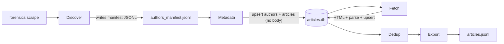

# Scraper concurrency and scaling improvements

## Guiding constraints
- Incremental fixes only in Phases A–C. Keep `Repository`, `sqlite3`, the single-connection + `db_lock` model, and the existing classes.
- No provider swaps. No behavioral change to public CLI flags.
- Phase D is a written decision memo only; no code.
- Preserve resumability (skip rows already fetched / URLs already stored) and all existing JSONL side-channels.

## Current flow (for reference)



Hotspots confirmed by reading [src/forensics/scraper/fetcher.py](src/forensics/scraper/fetcher.py), [src/forensics/scraper/crawler.py](src/forensics/scraper/crawler.py), [src/forensics/scraper/dedup.py](src/forensics/scraper/dedup.py), [src/forensics/storage/repository.py](src/forensics/storage/repository.py), [src/forensics/storage/export.py](src/forensics/storage/export.py):

1. `_fetch_one_article_html` holds `db_lock` across HTTP parse + raw HTML write + simhash-relevant metadata merge + `upsert_article`. That serializes the CPU + disk + SQL portion even though the HTTP layer is already gated by a semaphore.
2. `discover_authors` makes N sequential post-count HTTP calls (one per user).
3. `collect_article_metadata` iterates authors strictly sequentially.
4. `append_jsonl` (used for warnings / coauth) is called synchronously from async code, unlike `append_scrape_error` which already uses `asyncio.to_thread`.
5. `deduplicate_articles` calls `repo.get_all_articles()` which materializes every `Article` (including `clean_text`) in memory; `export_articles_jsonl` does the same.

---

## Phase A: Low-risk in-place fixes

### A1. Shrink the `db_lock` critical section in [src/forensics/scraper/fetcher.py](src/forensics/scraper/fetcher.py)

Refactor `_fetch_one_article_html` so the lock only wraps short SQL calls:

- Before the lock: HTTP is already done. Compute `scraped_at`, `final_host`, and, for the success path, call `extract_article_text`, `extract_metadata`, `word_count`, `content_hash`, and `_write_raw_html_file` — all CPU/disk, no shared state.
- Enter lock: `get_article_by_id` and the resume guard (`if article is None or clean_text.strip()`). If guard passes, mutate fields on the loaded `Article` and `upsert_article`. Exit lock.
- Progress increment (`done_lock`) stays as-is.

Rationale: the lock exists to protect the single `sqlite3` connection, not the parser or the filesystem. This removes the de-facto serialization of parse + file write under high `max_concurrent`.

Split the three persistence helpers accordingly:
- `_persist_http_failed_fetch`, `_persist_off_domain_fetch`, `_persist_successful_fetch` become "build the `Article` mutation" (pure) + "commit under lock" (tiny). A helper like `_commit_article(repo, article)` under lock keeps the call sites readable.

### A2. Offload sync `sqlite3` calls with `asyncio.to_thread`

Inside the (now-tiny) locked sections, wrap `repo.get_article_by_id(...)` and `repo.upsert_article(...)` in `await asyncio.to_thread(...)`. The `db_lock` still serializes access to the one connection; `to_thread` only prevents blocking the event loop during the SQL call.

Apply the same pattern to `repo.upsert_author(...)` and `repo.upsert_article(...)` calls in `_ingest_author_posts` ([src/forensics/scraper/crawler.py](src/forensics/scraper/crawler.py)) once Phase B turns it into a gathered coroutine.

### A3. Parallelize per-user post counts in `discover_authors`

In [src/forensics/scraper/crawler.py](src/forensics/scraper/crawler.py), replace the sequential `for user in user_rows:` post-count loop with:

- Bounded `asyncio.Semaphore(max(1, scraping.max_concurrent))`.
- `asyncio.gather(*[count_one(u) for u in user_rows])`.
- `RateLimiter` stays global (already shared), so politeness is preserved.
- Manifest ordering is reconstructed by sorting on `total_posts` afterwards, matching current behavior.

### A4. Make `append_jsonl` safe under asyncio

Two options, pick one:
- Add `async def append_jsonl_async(path, record)` in [src/forensics/storage/export.py](src/forensics/storage/export.py) that mirrors `append_scrape_error` (`asyncio.to_thread` + a per-loop lock), and swap the two call sites in `_persist_successful_fetch` to use it.
- Or call `await asyncio.to_thread(append_jsonl, ...)` directly in the fetcher. Simpler; slightly more scattered.

Recommendation: add `append_jsonl_async` so future callers don't re-introduce the footgun.

### A5. Phase A tests
- Unit test: `_fetch_one_article_html` success / 404 / off-domain / redirect paths still persist correctly; re-run path still respects the resume guard.
- Concurrency smoke test: with `max_concurrent = 4`, multiple tasks can be mid-parse while only one holds the lock (assert via an instrumented fake `Repository` that measures lock hold time < parse time).
- Discovery test: monkeypatch `request_with_retry` to count calls and verify post-count calls overlap under a semaphore of 4.

---

## Phase B: Parallel metadata across authors

### B1. Change `collect_article_metadata` in [src/forensics/scraper/crawler.py](src/forensics/scraper/crawler.py)

Replace:

```python
for cfg in author_cfgs:
    ins += await _ingest_author_posts(client, limiter, scraping, r, cfg, by_slug, errors)
```

with a bounded gather:

- `sem = asyncio.Semaphore(max(1, scraping.max_concurrent))`
- `db_lock = asyncio.Lock()` threaded into `_ingest_author_posts` so its `upsert_author` / `upsert_article` / `article_url_exists` calls serialize against each other.
- Each author still paginates sequentially inside its own coroutine (keeps WP pagination order and makes rate-limited backoff obvious).
- `asyncio.gather(*coros, return_exceptions=False)` with per-author try/except that logs to `scrape_errors.jsonl` instead of failing the whole run.

Per-author logging stays useful ("N articles indexed for {author}") because each coroutine logs independently.

### B2. Share a `RateLimiter` across authors
Already the case (one limiter per call). Confirm it still gates globally when multiple authors are in flight. No code change expected.

### B3. Phase B tests
- Author fan-out test: 5 authors × 3 pages, assert no two `_ingest_author_posts` coroutines run inside the lock simultaneously but HTTP calls interleave.
- Failure isolation test: one author raising `httpx.RequestError` does not prevent the others from completing.

---

## Phase C: Streaming dedup and export

Goal: remove the "load every `Article` into memory" pattern so the tool scales from ~thousands to ~hundreds of thousands of rows.

### C1. Stream export in [src/forensics/storage/export.py](src/forensics/storage/export.py)

- Add `iter_all_articles()` on `Repository` that yields `Article` rows from a cursor instead of `fetchall()` + list comprehension. Use `conn.execute(...).fetchmany(batch_size)` in a loop, or `for row in conn.execute(...)` (cursor iteration).
- Rewrite `export_articles_jsonl` to iterate the generator and stream-write lines. Memory stays O(batch_size).

### C2. Stream dedup in [src/forensics/scraper/dedup.py](src/forensics/scraper/dedup.py)

Problem: `get_all_articles()` loads `clean_text` for every row. Simhash is the only thing you need the text for, and only once per row.

- Add a helper on `Repository` that yields `(id, published_date, clean_text)` tuples for eligible rows (non-empty, not `[REDIRECT:`), in chunks.
- First pass: stream rows, compute fingerprint, store `(id, published_date, fingerprint)` in a compact list (8 bytes + small objects; 100k rows ~= a few MB). Do NOT keep `clean_text`.
- Second pass: existing banded-LSH union-find over fingerprints (unchanged math).
- Third pass: for non-canonical members, issue `UPDATE articles SET is_duplicate = 1 WHERE id IN (?, ?, ...)` in chunks instead of re-upserting full rows. Add a small `repo.mark_duplicates(ids)` method.

Benefits: memory drops from O(corpus_size × avg_article_bytes) to O(corpus_size × ~64 bytes).

### C3. Phase C tests
- Export: run on a fixture with N=10 rows, verify line count + content equivalence with prior implementation.
- Dedup: golden test comparing old implementation vs streaming implementation on the current small fixture corpus produces identical `is_duplicate` sets.

---

## Phase D: Structural decision memo (no code)

Deliverable: a short doc at `docs/adr/ADR-004-scraper-storage-concurrency.md` capturing the tradeoffs between the two candidates, with a recommendation. Do NOT implement until you approve.

### Candidate 1: Writer-queue pattern (producer/consumer)
- Fetch coroutines push completed `Article` updates onto an `asyncio.Queue`.
- One dedicated "writer task" drains the queue and calls `upsert_article` on the single connection.
- Pros: no lock contention, no `to_thread` around every SQL call, natural batching (`BEGIN; ... COMMIT;` per 100 rows), keeps `sqlite3`.
- Cons: adds a coordination layer; graceful shutdown and error propagation need care (sentinel on queue + gather writer with fetchers).

### Candidate 2: `aiosqlite` swap
- Replace `sqlite3` calls in `Repository` with `aiosqlite`.
- Pros: idiomatic async; no thread pool needed.
- Cons: bigger diff across [src/forensics/storage/repository.py](src/forensics/storage/repository.py) and every caller; changes the "is this synchronous?" contract of `Repository`; aiosqlite still serializes on one connection under the hood, so throughput gain over Phase A+B may be modest.

Recommendation to state in the ADR: prefer Candidate 1 (writer-queue) as the next structural step, because it preserves the `Repository` surface, keeps synchronous call sites working (dedup/export), and its main benefit — batched transactions — directly attacks the next bottleneck after Phases A–C.

---

## Sequencing and rollout
1. Land Phase A as one PR (fetcher refactor + discovery fan-out + `append_jsonl_async`). Run full `forensics scrape` against the live DB at [data/articles.db](data/articles.db) with `dry-run` then live on a small author subset.
2. Land Phase B as a second PR once A is stable. Watch `scrape_errors.jsonl` for new ordering-sensitive failures.
3. Land Phase C as a third PR. Benchmark dedup/export before and after on current corpus.
4. Review ADR from Phase D; decide whether to proceed with writer-queue before investing further.

## Out of scope (explicit)
- No changes to WordPress endpoints, user-agent, or retry/backoff policy.
- No changes to the schema in [src/forensics/storage/repository.py](src/forensics/storage/repository.py) beyond adding read-side iterators and a `mark_duplicates` helper.
- No changes to `archive_raw_year_dirs` or the `raw/` layout.
- No removal of existing `db_lock` / `done_lock` primitives.
