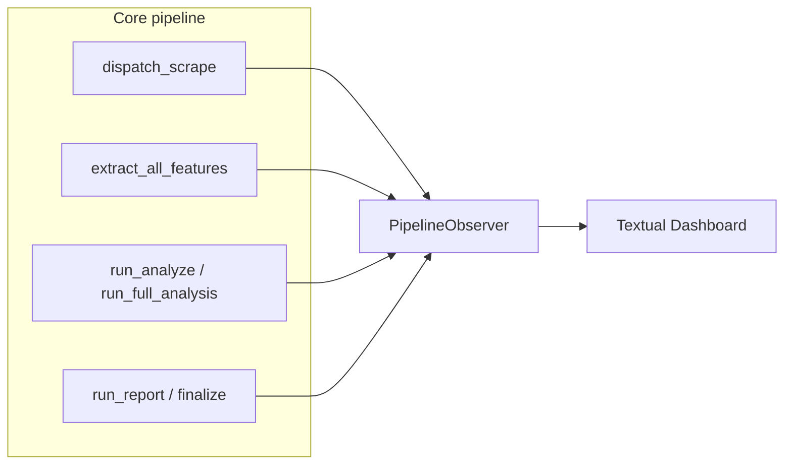

# Unified TUI pipeline dashboard

## Context (what exists today)

- **Full pipeline** ([`src/forensics/pipeline.py`](src/forensics/pipeline.py)): `dispatch_scrape` → `extract_all_features` → `run_analyze` → `run_report` — sequential, logging only.
- **Survey** ([`src/forensics/survey/orchestrator.py`](src/forensics/survey/orchestrator.py)): optional `dispatch_scrape` (survey uses `all_authors=True`), then per-qualified-author `extract_all_features` + `run_full_analysis` in a loop with checkpoint writes. No `run_report`; completion is **Finalize** (rank + `survey_results.json`).
- **Scrape**: [`collect_article_metadata`](src/forensics/scraper/crawler.py) runs `_ingest_one` per author under a semaphore (good hook point for **per-author scrape progress**). [`fetch_articles`](src/forensics/scraper/fetcher.py) tracks `done_count` / `total` at article granularity (good for a **live fetch bar**, optionally grouped by author later if you join row → author in the repo layer).
- **TUI today**: [`src/forensics/tui/app.py`](src/forensics/tui/app.py) is a **setup wizard** only; entry [`forensics-setup`](pyproject.toml) / `forensics setup`. Optional extra **`tui`** already lists `textual` + `rich`; [`extract_all_features`](src/forensics/features/pipeline.py) already uses `rich.progress` when run in a normal terminal.

## Branch workflow (GitButler)

Per [GitButler skill](.cursor/skills/gitbutler/SKILL.md), before coding:

1. `but status -fv`
2. `but branch new tui-pipeline-dashboard` (or your preferred name)
3. Assign changed files to that branch as you go; commits use `but commit ... --changes ... --status-after`

This keeps work on a **parallel virtual branch** without replacing normal `git` reads.

## Architecture (incremental, no provider swap)

Introduce a small **optional observer** (protocol + no-op default) passed through existing call chains. Orchestrators stay the source of truth; the TUI only renders events.

- **Thread/async safety**: Textual’s loop owns the UI. Long work should run in a **Textual `Worker`** (or a thread) that calls observer methods; the observer implementation uses `app.call_from_thread(...)` (or queues into the Textual app) to mutate widgets. Avoid running the whole asyncio scrape stack on the Textual loop without careful integration (nested loops); prefer **worker thread + `asyncio.run(dispatch_scrape(...))`** in that thread for scrape/survey sub-phases, with UI updates marshaled to the main thread.

**Suggested module layout** (names illustrative):

- [`src/forensics/progress/`](src/forensics/progress/) — `PipelineObserver` protocol, `PipelineStage` enum, `NoOpPipelineObserver`, maybe `RichPipelineObserver` for a non-TUI smoke mode.
- Thread-safe **event aggregation** (e.g. “current author slug + sub-phase”) kept minimal to satisfy “per-author during survey scrape.”

### Hook points (minimal signature churn)

| Location | Events to emit |
|----------|----------------|
| [`dispatch_scrape`](src/forensics/cli/scrape.py) / `_run_scrape_mode` | Stage start/end: discover, metadata, fetch, dedup, export (map internal helpers to these labels). |
| [`collect_article_metadata`](src/forensics/scraper/crawler.py) | After each `_ingest_one` completes: `author_done(slug, inserted_count)`; optional `author_started`. |
| [`fetch_articles`](src/forensics/scraper/fetcher.py) | Throttled `fetch_progress(done, total)` (e.g. every 1–2% or every N completions) to avoid UI flood. |
| [`run_survey`](src/forensics/survey/orchestrator.py) | Survey-level stages; before/after `_process_author`; pass observer into `dispatch_scrape` when `not skip_scrape`. |
| [`run_all_pipeline`](src/forensics/pipeline.py) | Wrap each macro stage; pass observer into `dispatch_scrape` and downstream if those functions accept `observer=...`. |
| [`extract_all_features`](src/forensics/features/pipeline.py) | Either emit observer events alongside existing Rich `Progress`, or disable Rich when `observer` is non-noop to prevent double UI (recommended: **suppress Rich bar when observer is active**). |

All new parameters should default to **`None`** / no-op so existing CLI and tests unchanged.

## Textual / Rich dashboard UX

New **second** Textual app (keep wizard separate):

- **New file(s)**: e.g. [`src/forensics/tui/pipeline_app.py`](src/forensics/tui/pipeline_app.py) + small widgets module.
- **Layout**:
  - **Top row**: four (or five for survey) **pipeline steps** — Scrape → Extract → Analyze → Report/Finalize — with state: `pending` / `running` / `done` / `error` (Textual `Static` + styles, or `ProgressBar` per step).
  - **Middle**: **Per-author table** during scrape (metadata completion) and during survey per-author loop: columns e.g. `Author`, `Scrape`, `Extract`, `Analyze`, `Notes`. For fetch (article-parallel), show a **single live progress** row or merge into “Fetch” column as `%` until author-level grouping is justified by data.
  - **Bottom**: `RichLog` or `Log` for tail events (errors, stage transitions); optional elapsed timer.
- **Entry point**: extend [`src/forensics/tui/__init__.py`](src/forensics/tui/__init__.py) with `main_dashboard()` or add Typer subcommand under [`src/forensics/cli/__init__.py`](src/forensics/cli/__init__.py) e.g. `forensics dashboard` with `--survey` vs default **full pipeline**, reusing survey flags from [`src/forensics/cli/survey.py`](src/forensics/cli/survey.py) where practical (compose `run_survey` kwargs).

**Optional**: `forensics dashboard --rich` using only `rich.live.Live` for CI/SSH without Textual — nice-to-have after Textual path works.

## Testing

- **Unit tests** (no Textual): mock observer; assert `dispatch_scrape` / metadata path fires `author_done` in order for a tiny fake manifest (existing integration style in [`tests/integration/test_cli_scrape_dispatch.py`](tests/integration/test_cli_scrape_dispatch.py)).
- **Textual**: follow [`tests/test_tui.py`](tests/test_tui.py) — `pytest.importorskip("textual")`; use `Pilot` to assert key widgets mount and a synthetic observer tick updates labels (no real network).

## Documentation touch (only if you want it in-repo)

User did not request doc edits; **skip** unless you later ask. RUNBOOK one-liner can be a follow-up.

## Risks / scope control

- **Double event loop**: do not call `asyncio.run` from inside Textual’s running loop; use a worker thread for the heavy asyncio pipeline.
- **C901**: new hook calls should be thin one-liners; if `dispatch_scrape` grows, extract a tiny `_emit(observer, event)` helper to avoid new Ruff complexity debt on [`crawler.py`](src/forensics/scraper/crawler.py) (already has a per-file ignore).
