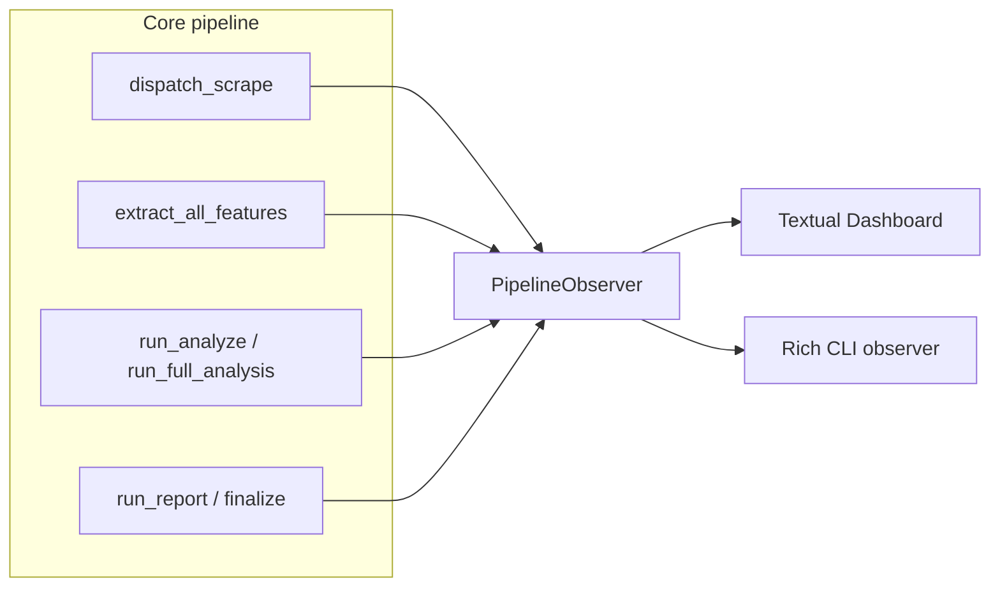

# Unified TUI pipeline dashboard

## Post-pull verification (2026-04-23)

Re-checked the tree after your pull. **No plan-affecting drift** was found:

- [`src/forensics/pipeline.py`](src/forensics/pipeline.py) — Still `asyncio.run(dispatch_scrape(...))` → `extract_all_features` → `run_analyze` → `run_report`; no observer or progress API yet.
- [`src/forensics/survey/orchestrator.py`](src/forensics/survey/orchestrator.py) — Survey still calls `dispatch_scrape(..., all_authors=True, post_year_min/max=...)` then the per-author `extract_all_features` / `run_full_analysis` loop with checkpoints; finalize remains rankings + `survey_results.json` (not `run_report`).
- [`src/forensics/scraper/crawler.py`](src/forensics/scraper/crawler.py) — `collect_article_metadata` still uses a nested `_ingest_one` + `asyncio.gather` over `author_cfgs` (per-author hook point unchanged).
- [`src/forensics/cli/__init__.py`](src/forensics/cli/__init__.py) — Subcommands unchanged; `forensics setup` maps to `setup_wizard()`; there is still **no** `dashboard` command — greenfield as planned.
- [`pyproject.toml`](pyproject.toml) — `tui` extra (`textual`, `rich`) and `forensics-setup` script unchanged; no `forensics.progress` package yet.
- [`tests/integration/test_cli_scrape_dispatch.py`](tests/integration/test_cli_scrape_dispatch.py) — Still present for scrape-dispatch integration tests.

Hook table, GitButler branch workflow, Textual worker-thread note, and C901 note for `crawler.py` remain accurate.

## Context (what exists today)

- **Full pipeline** ([`src/forensics/pipeline.py`](src/forensics/pipeline.py)): `dispatch_scrape` → `extract_all_features` → `run_analyze` → `run_report` — sequential, logging only.
- **Survey** ([`src/forensics/survey/orchestrator.py`](src/forensics/survey/orchestrator.py)): optional `dispatch_scrape` (survey uses `all_authors=True`), then per-qualified-author `extract_all_features` + `run_full_analysis` in a loop with checkpoint writes. No `run_report`; completion is **Finalize** (rank + `survey_results.json`).
- **Scrape**: [`collect_article_metadata`](src/forensics/scraper/crawler.py) runs `_ingest_one` per author under a semaphore (good hook point for **per-author scrape progress**). [`fetch_articles`](src/forensics/scraper/fetcher.py) tracks `done_count` / `total` at article granularity (good for a **live fetch bar**, optionally grouped by author later if you join row → author in the repo layer).
- **TUI today**: [`src/forensics/tui/app.py`](src/forensics/tui/app.py) is a **setup wizard** only; entry [`forensics-setup`](pyproject.toml) / `forensics setup`. Optional extra **`tui`** already lists `textual` + `rich`; [`extract_all_features`](src/forensics/features/pipeline.py) already uses `rich.progress` when run in a normal terminal.

## Branch workflow (GitButler)

Per [GitButler skill](.cursor/skills/gitbutler/SKILL.md), before coding:

1. `but status -fv`
2. `but branch new tui-pipeline-dashboard` (or your preferred name)
3. Assign changed files to that branch as you go; commits use `but commit ... --changes ... --status-after`

This keeps work on a **parallel virtual branch** without replacing normal `git` reads.

## Architecture (incremental, no provider swap)

Introduce a small **optional observer** (protocol + no-op default) passed through existing call chains. Orchestrators stay the source of truth; the TUI only renders events.

When the user runs **`forensics dashboard`**, attach a **Textual**-backed observer only. When they run **`forensics all`**, **`forensics survey`**, **`forensics scrape`**, etc., attach **`RichPipelineObserver`** by default so stages and per-author work show **`rich.progress`** (and existing extract bars stay consistent). **`--no-progress`** turns off Rich observers and suppresses extract’s Rich bar — plain logging only (CI, redirected logs, minimal terminals).

- **Thread/async safety**: Textual’s loop owns the UI. Long work should run in a **Textual `Worker`** (or a thread) that calls observer methods; the observer implementation uses `app.call_from_thread(...)` (or queues into the Textual app) to mutate widgets. Avoid running the whole asyncio scrape stack on the Textual loop without careful integration (nested loops); prefer **worker thread + `asyncio.run(dispatch_scrape(...))`** in that thread for scrape/survey sub-phases, with UI updates marshaled to the main thread.

**Suggested module layout** (names illustrative):

- [`src/forensics/progress/`](src/forensics/progress/) — `PipelineObserver` protocol, `PipelineStage` enum, `NoOpPipelineObserver`, **`RichPipelineObserver`** (default for non-dashboard CLI), **`TextualPipelineObserver`** or inline adapter in `tui/pipeline_app.py` for the dashboard.
- Thread-safe **event aggregation** (e.g. “current author slug + sub-phase”) kept minimal to satisfy “per-author during survey scrape.”

### Hook points (minimal signature churn)

| Location | Events to emit |
|----------|----------------|
| [`dispatch_scrape`](src/forensics/cli/scrape.py) / `_run_scrape_mode` | Stage start/end: discover, metadata, fetch, dedup, export (map internal helpers to these labels). |
| [`collect_article_metadata`](src/forensics/scraper/crawler.py) | After each `_ingest_one` completes: `author_done(slug, inserted_count)`; optional `author_started`. |
| [`fetch_articles`](src/forensics/scraper/fetcher.py) | Throttled `fetch_progress(done, total)` (e.g. every 1–2% or every N completions) to avoid UI flood. |
| [`run_survey`](src/forensics/survey/orchestrator.py) | Survey-level stages; before/after `_process_author`; pass observer into `dispatch_scrape` when `not skip_scrape`. |
| [`run_all_pipeline`](src/forensics/pipeline.py) | Wrap each macro stage; pass observer into `dispatch_scrape` and downstream if those functions accept `observer=...`. |
| [`extract_all_features`](src/forensics/features/pipeline.py) | **If** a pipeline observer is active: suppress the built-in Rich task bar when the observer is **Textual** or **Rich** (same information surfaced once). If `--no-progress`: no Rich bar and no observer. |

All new parameters should default to **`None`** / no-op so existing CLI and tests unchanged.

### CLI — Rich default and opt-out

- Add **`--no-progress`** (name bikesheddable; alternatives `--plain`, `--no-ui`) on the **root** [`forensics` callback](src/forensics/cli/__init__.py) via `Typer` context (`ctx.obj` holding a small `CliRuntimeOptions(show_progress: bool)`), so every subcommand can read the same flag without duplicating it on ten Typer apps.
- **Default** `show_progress=True`: long commands (`all`, `survey`, scrape full pipeline, extract if long enough) pass a **`RichPipelineObserver`** into the shared observer plumbing.
- **`--no-progress`**: force **no** `RichPipelineObserver`, no Textual progress, and **disable** the per-author `rich.progress` block in `extract_all_features` (today it always shows when not single-author fast path — align with the global flag).
- **`forensics dashboard`**: does not use the Rich default on stdout (Textual owns the screen); root `--no-progress` can still disable the dashboard launch with a clear error or fall back to log-only worker — document one behavior (recommend **error**: “use `forensics all --no-progress` for non-TUI without progress”).

## Textual / Rich dashboard UX

New **second** Textual app (keep wizard separate):

- **New file(s)**: e.g. [`src/forensics/tui/pipeline_app.py`](src/forensics/tui/pipeline_app.py) + small widgets module.
- **Layout**:
  - **Top row**: four (or five for survey) **pipeline steps** — Scrape → Extract → Analyze → Report/Finalize — with state: `pending` / `running` / `done` / `error` (Textual `Static` + styles, or `ProgressBar` per step).
  - **Middle**: **Per-author table** during scrape (metadata completion) and during survey per-author loop: columns e.g. `Author`, `Scrape`, `Extract`, `Analyze`, `Notes`. For fetch (article-parallel), show a **single live progress** row or merge into “Fetch” column as `%` until author-level grouping is justified by data.
  - **Bottom**: `RichLog` or `Log` for tail events (errors, stage transitions); optional elapsed timer.
- **Entry point**: extend [`src/forensics/tui/__init__.py`](src/forensics/tui/__init__.py) with `main_dashboard()` or add Typer subcommand under [`src/forensics/cli/__init__.py`](src/forensics/cli/__init__.py) e.g. `forensics dashboard` with `--survey` vs default **full pipeline**, reusing survey flags from [`src/forensics/cli/survey.py`](src/forensics/cli/survey.py) where practical (compose `run_survey` kwargs).

**Non-dashboard runs**: users keep using `forensics all` / `survey` / `scrape` as today; they automatically get **Rich** stage and per-author bars unless **`--no-progress`**. No `tui` extra required for Rich (already available via Typer); Textual remains optional for **`dashboard`** only.

**Optional later**: `forensics dashboard --rich-fallback` using `rich.live.Live` when Textual is unavailable — only if product asks; not required for this iteration.

## Testing

- **Unit tests** (no Textual): mock observer; assert `dispatch_scrape` / metadata path fires `author_done` in order for a tiny fake manifest (existing integration style in [`tests/integration/test_cli_scrape_dispatch.py`](tests/integration/test_cli_scrape_dispatch.py)).
- **Textual**: follow [`tests/test_tui.py`](tests/test_tui.py) — `pytest.importorskip("textual")`; use `Pilot` to assert key widgets mount and a synthetic observer tick updates labels (no real network).

## Documentation touch (only if you want it in-repo)

User did not request doc edits; **skip** unless you later ask. RUNBOOK one-liner can be a follow-up.

## Risks / scope control

- **Double event loop**: do not call `asyncio.run` from inside Textual’s running loop; use a worker thread for the heavy asyncio pipeline.
- **C901**: new hook calls should be thin one-liners; if `dispatch_scrape` grows, extract a tiny `_emit(observer, event)` helper to avoid new Ruff complexity debt on [`crawler.py`](src/forensics/scraper/crawler.py) (already has a per-file ignore).
