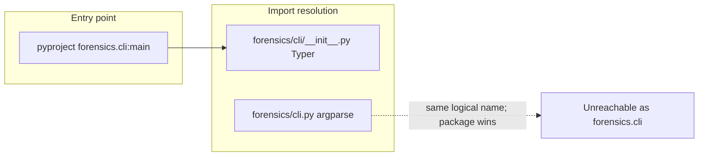

# Typer CLI migration — status and finish line

## Current state (verified)

- [`pyproject.toml`](pyproject.toml) entry point `forensics = "forensics.cli:main"` resolves to the **package** [`src/forensics/cli/__init__.py`](src/forensics/cli/__init__.py) (Typer `app` + `main()`), not the sibling file `cli.py`. Confirmed earlier with `uv run python -c "import forensics.cli; print(forensics.cli.__file__)"` → `cli/__init__.py`.
- Subcommands live under [`src/forensics/cli/`](src/forensics/cli/) (`scrape.py`, `extract.py`, `analyze.py`, `report.py`, `_helpers.py`); [`src/forensics/pipeline.py`](src/forensics/pipeline.py) imports from this package.
- Integration tests already target Typer ([`tests/integration/test_cli.py`](tests/integration/test_cli.py), [`tests/integration/test_cli_scrape_dispatch.py`](tests/integration/test_cli_scrape_dispatch.py)).
- **No `click` usage** in the project; **argparse** remains only on ancillary scripts ([`evals/baseline_quality.py`](evals/baseline_quality.py), [`scripts/generate_baseline.py`](scripts/generate_baseline.py)) — these are separate from the `forensics` console script.

## Gaps to close

1. **Legacy [`src/forensics/cli.py`](src/forensics/cli.py)** (~500 lines): Shadowed by the `cli/` package; effectively dead for `import forensics.cli`. It still implements argparse and calls `run_ai_baseline_command` with removed kwargs (`openai_key`, `llm_model`) that no longer exist on [`run_ai_baseline_command`](src/forensics/analysis/drift.py) — so it is misleading and unsafe if someone ever executed it via a renamed import. Phase 11 prompt and [`docs/plans/2026-04-20-typer-cli-migration.md`](docs/plans/2026-04-20-typer-cli-migration.md) already specify **deleting** this file after migration; [`HANDOFF.md`](HANDOFF.md) even records it as deleted though the file is still present — repo and handoff are out of sync.
2. **Documentation drift**: [`AGENTS.md`](AGENTS.md) and [`docs/ARCHITECTURE.md`](docs/ARCHITECTURE.md) still list `src/forensics/cli.py` as the CLI (argparse). [`docs/GUARDRAILS.md`](docs/GUARDRAILS.md) references `cli.py` in guardrail wording — should point at the `cli/` package or `pipeline.py` only.
3. **Optional scope (defer unless you want one CLI stack everywhere)**: Migrating [`evals/baseline_quality.py`](evals/baseline_quality.py) and [`scripts/generate_baseline.py`](evals/baseline_quality.py) from argparse to Typer would be consistency-only; no impact on the `forensics` command.

## Implementation plan

1. **Delete** [`src/forensics/cli.py`](src/forensics/cli.py). After removal, `forensics.cli` still resolves to the package only; no entry-point or `__main__.py` change needed.
2. **Repo-wide sanity check** (read-only grep before/after): ensure no `from forensics.cli import build_parser` or imports of symbols defined only in the old file (`_async_scrape`, etc.). Prior grep showed `build_parser` only referenced inside `cli.py` itself.
3. **Update high-traffic docs** to match reality:
   - [`AGENTS.md`](AGENTS.md): CLI path → `src/forensics/cli/` (Typer).
   - [`docs/ARCHITECTURE.md`](docs/ARCHITECTURE.md): same.
   - [`docs/GUARDRAILS.md`](docs/GUARDRAILS.md): replace “`cli.py`” phrasing with “CLI package (`forensics/cli/`)” or “orchestration (`pipeline.py`)” where it describes architecture triggers.
   - Optionally add a one-line correction under [`HANDOFF.md`](HANDOFF.md) completion log if you want the log to match the eventual delete (minimal edit).
4. **Leave as-is unless you ask**: Historical phase prompts under `prompts/` and ADRs under `docs/adr/` that mention `cli.py` — they are archival context; bulk-editing creates noise. README already states the legacy file correctly; after delete, adjust that README bullet to say the argparse module was removed (not “legacy module still present”).
5. **Verification** (when implementing): `uv run forensics --help`, `uv run python -m forensics --help`, and `uv run pytest tests/integration/test_cli.py tests/integration/test_cli_scrape_dispatch.py` (then broader `uv run pytest` if time).

## Non-goals (this pass)

- Rewriting ADRs or old phase prompt files for historical accuracy.
- Migrating eval/script argparse to Typer (optional follow-up).
- Any change to Typer command surfaces or `pipeline.py` orchestration — only removal of dead code and doc alignment.
